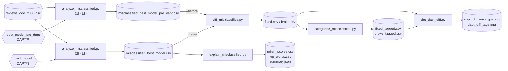

# scripts/

実行スクリプト群。用途別のサブディレクトリに分類されています。

## ディレクトリ構成

```
scripts/
├── collect/            # データ収集
├── nlp/                # NLP本番実行
├── misclassification/  # 誤分類の分析パイプライン
├── evaluation/         # モデル評価・比較・多シード検証
├── learning_curve/     # データ量と精度の関係
├── topic/              # トピック抽出実験
└── benchmarks/         # 性能・実行可能性の計測
```

---

## 全体の流れ

Steam APIから集めたCSVが、学習 → 評価 → 分析へ受け渡されていきます。
スクリプト同士は**基本的にファイル（CSV/モデル）で繋がっており**、直接呼び合うのは点線の2箇所だけです。

```mermaid
flowchart TD
    API(["Steam API"])

    subgraph SC["collect/ — 収集"]
        C10["collect_dataset_10k.py"]
        COOD["collect_ood_testset.py"]
        CDAPT["collect_dapt_corpus.py"]
    end

    subgraph SN["nlp/ — 学習・抽出"]
        TD["train_dapt.py"]
        TS["train_sentiment.py"]
        ET["extract_topics.py"]
    end

    subgraph SEV["evaluation/ ・ learning_curve/ — 評価"]
        CO["compare_models_ood.py"]
        SS["seed_study.py"]
        LC["learning_curve_experiment.py"]
    end

    API --> C10
    API --> COOD
    API --> CDAPT

    C10 --> D10[("data/train/reviews_10000.csv")]
    COOD --> DOOD[("data/test/reviews_ood_2000.csv")]
    CDAPT --> DCO[("data/dapt/corpus.csv")]

    DCO --> TD
    TD --> MDAPT{{"models/dapt_distilbert"}}

    D10 --> TS
    MDAPT -. "--base-model" .-> TS
    TS --> MBEST{{"models/best_model"}}

    D10 --> ET
    ET --> DTOP[("reviews_10000_with_topics.csv")]

    DOOD --> CO
    MBEST --> CO
    CO --> DBM[("data/experiments/ood_benchmark/")]

    SS -. "train_sentiment&#40;&#41; を import" .-> TS
    LC -. "train_sentiment&#40;&#41; を import" .-> TS
    SS --> DSS[("data/experiments/seed_study/results.csv")]
    LC --> DLC[("data/experiments/learning_curve/results.csv")]
```



| 図形 | 意味 |
|---|---|
| 四角 | スクリプト |
| 円筒 | データ（CSV） |
| 六角形 | モデル（ディレクトリ） |
| 点線 | ファイルを介さず、Pythonの関数として直接呼んでいる関係 |

DAPTパイプラインを順に回す場合は `collect-dapt-corpus` → `train-dapt` → `train-sentiment-dapt` → `compare-ood` の順です。


---

## collect/ — データ収集

Steam APIからレビューデータを収集するスクリプト。  
収集したデータは `data/train/` に保存されます。

| ファイル | 説明 |
|---|---|
| `collect_dataset_10k.py` | 10000件のbalancedレビューを収集（学習用・推奨） |
| `collect_dataset_20k.py` | 20000件のbalancedレビューを収集 |
| `collect_ood_testset.py` | OOD評価用テストセット収集（未知20ゲーム・ジャンル/タグ偏り対策） |
| `collect_dapt_corpus.py` | DAPT用の未ラベルコーパス収集（多様な10万件・OOD/学習ゲーム除外） |

**使用方法:**
```bash
make collect-10k           # 10000件（学習用）
make collect-ood           # OODテストセット
make collect-dapt-corpus   # DAPT用コーパス（10万件・未ラベル）
```

---

## nlp/ — NLP本番実行

感情分析モデルの学習とトピック抽出の本番実行スクリプト。  
通常は `make` コマンド経由で実行します。

| ファイル | 説明 |
|---|---|
| `train_sentiment.py` | DistilBERTの感情分析モデル学習（本番・実験兼用） |
| `train_dapt.py` | DAPT（未ラベルレビューでMLM継続学習・ドメイン適応モデル作成） |
| `extract_topics.py` | BERTopicによるトピック抽出（本番実行） |

**使用方法:**
```bash
make train-sentiment       # vanillaベースライン（best_model_pre_dapt上書き）
make train-dapt            # DAPT（MLM継続学習・要コーパス）
make train-sentiment-dapt  # DAPT baseで微調整（best_model上書き・本番）
make train-test            # パイプライン確認用（短時間）
make extract-topics        # トピック抽出
```

`train_sentiment.py` は `scripts/learning_curve/learning_curve_experiment.py` と `scripts/evaluation/seed_study.py` からもimportされます。

---

## misclassification/ — 誤分類の分析パイプライン

誤分類を「抽出 → タグ付け → 2モデル差分 → 解釈 → 可視化」する分析ツール群。

| ファイル | 説明 |
|---|---|
| `analyze_misclassified.py` | 任意モデル×未知データで誤分類を抽出（`--input`/`--model`） |
| `categorize_misclassified.py` | 誤分類のヒューリスティックタグ付け（`--input`） |
| `diff_misclassified.py` | 2モデルの誤分類差分（fixed/broke抽出・`--before`/`--after`） |
| `explain_misclassified.py` | 誤分類の解釈（Layer Integrated Gradientsで寄与語抽出・`--input`/`--model`） |
| `plot_dapt_diff.py` | DAPT前後の誤分類差分を可視化（fixed/broke・タグ別） |

### 実行順序

`analyze_misclassified.py` を**2回**（DAPT前モデル・DAPT後モデル）走らせ、その差分を追っていく流れです。
表だけでは、どのCSVがどのスクリプトの入力になるかが読み取れないため図にしています。



`fixed` は「DAPT後に直ったレビュー」、`broke` は「DAPT後に壊れたレビュー」です。
`plot_dapt_diff.py` は fixed/broke の**素のCSVとタグ付きCSVの両方**を読むため、`categorize_misclassified.py` を先に通しておく必要があります。


---

## evaluation/ — モデル評価・比較・検証

| ファイル | 説明 |
|---|---|
| `compare_models_ood.py` | 複数モデルのOOD性能比較（accuracy/P/R/F1・McNemar） |
| `seed_study.py` | 多シードでDAPT効果を検証（Issue#24・平均±SD＋ペア検定・代表モデル選定） |
| `validate_sentiment_english.py` | 英語100件での感情分析精度検証 |

**使用方法:**
```bash
make compare-ood            # OOD性能比較
make seed-study             # 多シード検証（GPU長時間。SEEDS=15で数変更）
make seed-study-analyze     # 多シード検証の集計のみ
```

---

## learning_curve/ — データ量と精度の関係

| ファイル | 説明 |
|---|---|
| `learning_curve_experiment.py` | データ量と精度の関係を複数seedで検証 |
| `analyze_learning_curve.py` | Learning Curve実験結果の分析・可視化 |

**使用方法:**
```bash
make learning-curve                        # 10k vs 20k で比較（デフォルト）
make learning-curve SIZES="5000 10000"     # サイズを指定して比較
make analyze-curve                         # 実験結果の分析・可視化
```

---

## topic/ — トピック抽出実験

| ファイル | 説明 |
|---|---|
| `bertopic_experiment.py` | BERTopicパラメータ実験 |

---

## benchmarks/ — 性能・実行可能性の計測

GPU性能・ファインチューニング負荷・DAPTの実行可能性などを「測る」スクリプト。

| ファイル | 説明 |
|---|---|
| `gpu_benchmark.py` | GPU性能計測 |
| `benchmark_finetuning.py` | ファインチューニングのGPU負荷検証 |
| `dapt_feasibility.py` | DAPT着手前の実行可能性（メモリ・所要時間）計測 |

---

## 関連

- [../src/README.md](../src/README.md) — スクリプトが使う部品（モジュール）の一覧と依存関係
- [../tests/README.md](../tests/README.md) — テストと対象モジュールの対応
- [ドキュメントマップ](https://github.com/rindguitar/game-demand-forecast/wiki/Documentation-Map) — Wiki全体の繋がり
