# scripts/

実行スクリプト群。用途別のサブディレクトリに分類されています。

## ディレクトリ構成

```
scripts/
├── collect/            # データ収集
├── nlp/                # NLP本番実行
├── timeseries/         # 週次時系列の作成
├── misclassification/  # 誤分類の分析パイプライン
├── evaluation/         # モデル評価・比較・多シード検証
├── learning_curve/     # データ量と精度の関係
├── topic/              # トピック抽出実験
└── benchmarks/         # 性能・実行可能性の計測
```

---

## 全体の流れ

大きくは4段です。詳しい図は、それぞれのディレクトリの節にあります。

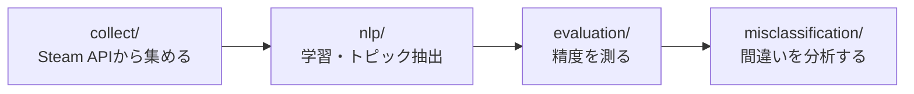

図の中の図形は共通で、**四角＝スクリプト / 円筒＝データ（CSV） / 六角形＝モデル** です。
矢印は「この出力が次の入力になる」という流れを表します。

---

## collect/ — データ収集

Steam APIからレビューデータを収集するスクリプト。  
収集したデータは `data/train/` に保存されます。

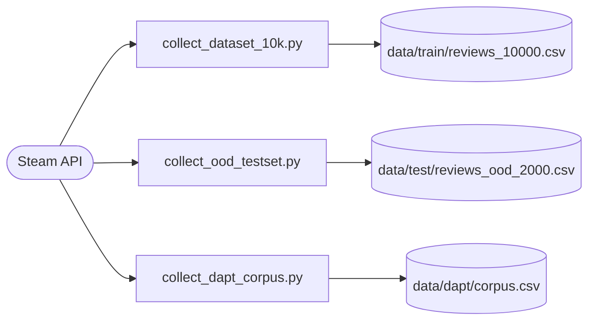

| ファイル | 説明 |
|---|---|
| `collect_dataset_10k.py` | 10000件のbalancedレビューを収集（学習用・推奨） |
| `collect_dataset_20k.py` | 20000件のbalancedレビューを収集 |
| `collect_ood_testset.py` | OOD評価用テストセット収集（未知20ゲーム・ジャンル/タグ偏り対策） |
| `collect_dapt_corpus.py` | DAPT用の未ラベルコーパス収集（多様な10万件・OOD/学習ゲーム除外） |
| `collect_timeseries_dataset.py` | 時系列予測用のレビュー収集（期間固定・自然比率・レビュー本文を保存）。母集団のメタ情報を `pool_cache.json` に貯めてから選定するため、条件を変えた選び直しは `--dry-run` で数秒。Issue #32 |
| `inspect_timeseries_dataset.py` | 収集した時系列データの偏り点検（収集の網羅性・自然比率・ゲーム別シェア・ジャンルの本数/量の乖離・参加ゲーム数の推移）。APIを叩かずCSVだけ読む |

**使用方法:**
```bash
make collect-10k           # 10000件（学習用）
make collect-ood           # OODテストセット
make collect-dapt-corpus   # DAPT用コーパス（10万件・未ラベル）
```

---

## nlp/ — NLP本番実行

感情分析モデルの学習とトピック抽出の本番実行スクリプト。  
通常は `make` コマンド経由で実行します。

**感情分析モデルができるまで**（左から順に実行する）

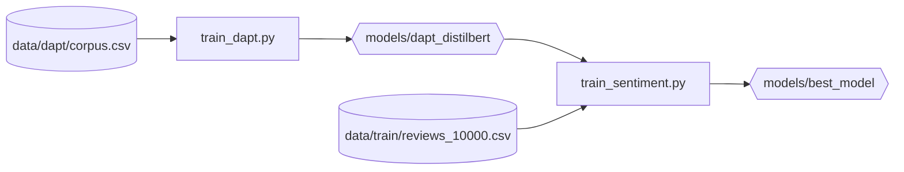

`train_dapt.py` が作るのは「Steamの言い回しに慣れただけ」のモデルで、まだ感情は判定できません。
それを土台に `train_sentiment.py` で微調整して、本番モデル `models/best_model` になります。

**トピック抽出と仕分け**（上とは独立に動く）

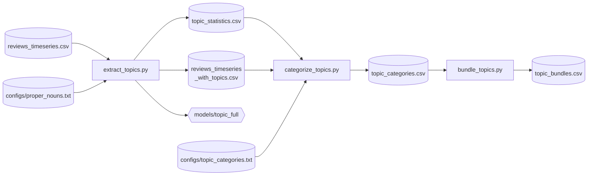

`extract_topics.py` は「どんな話題があるか」を出すところまで。
`categorize_topics.py` がそれを ①ゲーム要素 / ②品質・運営 / ③ビジネス条件 / 中身なし に仕分けます。
需要スコアに合算するのは①だけで、③は阻害要因として別枠に持ちます（`docs/decisions.md` 2026-08-18）。

`bundle_topics.py` は、週10件に届かない小さいトピックだけをSteamタグの語彙に寄せます。
大きいトピックはそのまま残し、タグに寄らないものは「その他」に集約します（`docs/decisions.md` 2026-08-31）。

`categorize_topics.py` と `bundle_topics.py` は上図のほかに `data/timeseries/games.csv` も読みます
（前者は土台パネルの顔ぶれを `tier` 列から、後者は束ね先の語彙をジャンル列・タグ列から取るため）。

**粒度を粗くして比べる**（抽出済みのモデルだけで動く・再学習しない）

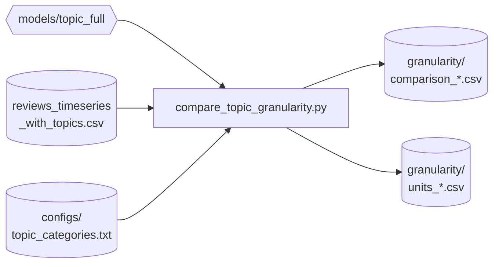

`compare_topic_granularity.py` は455トピックをマージ木にまとめ、200個 / 100個 ... と切りながら
どのレベルでも同じ物差しで測って並べます。トピックの目標粒度を決めるための材料で
（Issue #37）、日々のパイプラインには入りません。物差しの中身は `--help` を参照。

細かい側（トピックを増やす方向）はこの方法では作れません。`extract_topics.py` を
`--min-topic-size` を下げて回し直す必要があります。

**ゲーム単位の共起を出す**（どの部品が同じゲームに同居しているか）

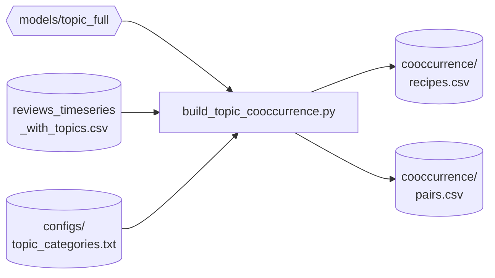

`build_topic_cooccurrence.py` は「そのゲームらしさ（リフト）」でゲームごとのレシピを作り、
同じレシピに入った部品のペアを数えます（Issue #42）。**出現では測りません** ——
素朴に「同じゲームに出るか」で数えると、時系列に乗る35単位のうち21個が全24本に出るため
ほぼ全結合になり情報にならないからです。

⚠️ **24本では「このペアが無い = 未開拓」は言えません**（ペアは44,850通り）。
読めるのはレシピと、観測された共起までです。

| ファイル | 説明 |
|---|---|
| `train_sentiment.py` | DistilBERTの感情分析モデル学習（本番・実験兼用） |
| `train_dapt.py` | DAPT（未ラベルレビューでMLM継続学習・ドメイン適応モデル作成） |
| `extract_topics.py` | BERTopicによるトピック抽出（本番実行） |
| `categorize_topics.py` | トピックの仕分け（①要素 / ②品質・運営 / ③ビジネス条件 / 中身なし / 固有名詞） |
| `bundle_topics.py` | 小さいトピックをSteamタグの語彙に束ねる |
| `compare_topic_granularity.py` | 粒度を粗い側へ動かし、レベルごとに同じ物差しで測って比べる（Issue #37） |
| `build_topic_cooccurrence.py` | ゲームごとのレシピと、部品ペアの共起を出す（Issue #42） |

**使用方法:**
```bash
make train-sentiment       # vanillaベースライン（best_model_pre_dapt上書き）
make train-dapt            # DAPT（MLM継続学習・要コーパス）
make train-sentiment-dapt  # DAPT baseで微調整（best_model上書き・本番）
make train-test            # パイプライン確認用（短時間）
make extract-topics        # トピック抽出
make compare-granularity   # 粒度レベルの比較（再学習しない）
```

`train_sentiment.py` は `scripts/learning_curve/learning_curve_experiment.py` と `scripts/evaluation/seed_study.py` からもimportされます。

---

## timeseries/ — 週次時系列の作成（Phase 6）

仕分け済みのトピックから、週次の時系列データを作ります。

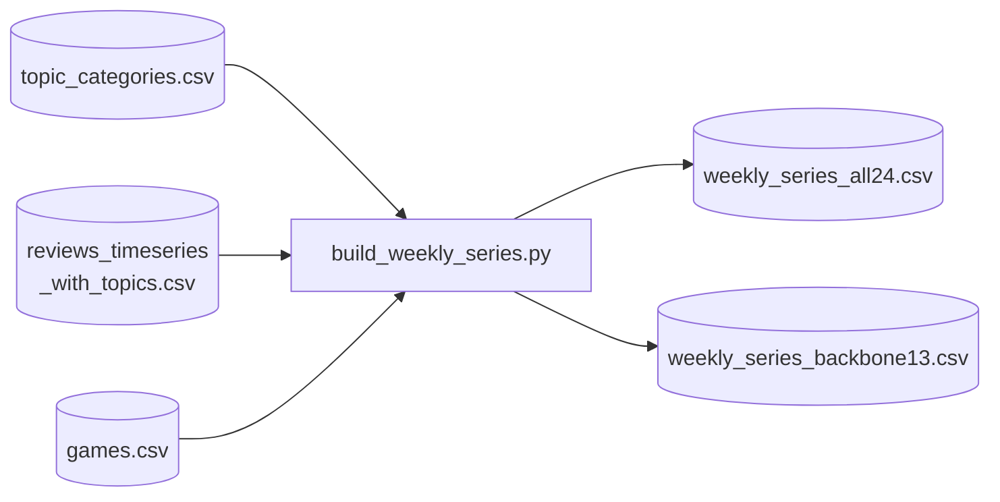

パネルを2枚作ります（`docs/decisions.md` 2026-09-05）。

| パネル | 顔ぶれ | 使い方 |
|---|---|---|
| `backbone13` | 期間中に発売が無い13本 | **絶対数**で引ける。主軸 |
| `all24` | 全24本 | 参加ゲームが入れ替わるので**シェア**で見る |

出力は縦長で、1行が「単位 × 週」です。列は `count`（言及数）/ `share`（その週の総言及数に対する割合）/
`positive_rate`（ポジ率）/ `expected_positive_rate`（ゲーム構成から期待されるポジ率）/
`positive_rate_gap`（その差＝充足度）/ `games`（参加ゲーム数）/ `total`（その週の総言及数）。

充足度は**差で見ます**。`voted_up` はゲーム全体への評価なので、絶対値だとそのトピックが
どのゲームの話かを読んでしまいます（→ `docs/decisions.md` 2026-09-07）。

| ファイル | 説明 |
|---|---|
| `build_weekly_series.py` | 週次時系列の作成と、系列の健全性の点検 |
| `plot_weekly_series.py` | 折れ線グラフの作成（`data/timeseries/plots/`） |

**使用方法:**
```bash
docker compose exec dev python scripts/timeseries/build_weekly_series.py
docker compose exec dev python scripts/timeseries/plot_weekly_series.py
```

図は1枚に線を重ねず、系列ごとに小さい図を並べます（`.claude/rules/mermaid.md` の
「1枚の線を減らす」と同じ理由）。コンテナに日本語フォントが無いのでラベルは英語です。

---

## misclassification/ — 誤分類の分析パイプライン

誤分類を「抽出 → タグ付け → 2モデル差分 → 解釈 → 可視化」する分析ツール群。

| ファイル | 説明 |
|---|---|
| `analyze_misclassified.py` | 任意モデル×未知データで誤分類を抽出（`--input`/`--model`） |
| `categorize_misclassified.py` | 誤分類のヒューリスティックタグ付け（`--input`） |
| `diff_misclassified.py` | 2モデルの誤分類差分（fixed/broke抽出・`--before`/`--after`） |
| `explain_misclassified.py` | 誤分類の解釈（Layer Integrated Gradientsで寄与語抽出・`--input`/`--model`） |
| `plot_dapt_diff.py` | DAPT前後の誤分類差分を可視化（fixed/broke・タグ別） |

### 手順1: 2つのモデルの誤分類を取り、差分を出す

同じ `analyze_misclassified.py` を、DAPT前とDAPT後で**2回**走らせます。

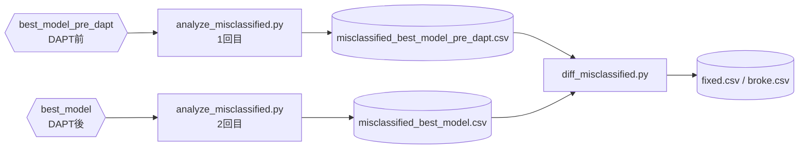

2回とも入力データは同じ `data/test/reviews_ood_2000.csv` です（線が増えて読みにくくなるため図では省略）。
`fixed` は「DAPT後に直ったレビュー」、`broke` は「DAPT後に壊れたレビュー」です。

### 手順2: 差分を分析する

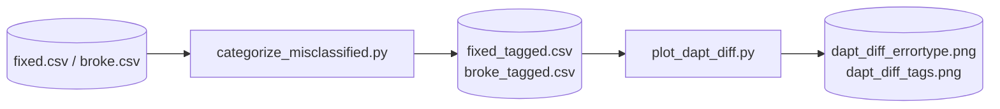

`plot_dapt_diff.py` はタグ付きCSVだけでなく、素の `fixed.csv` / `broke.csv` も読みます。
そのため `categorize_misclassified.py` を先に通しておく必要があります。

### 手順3: なぜ間違えたかを調べる（手順2とは独立）

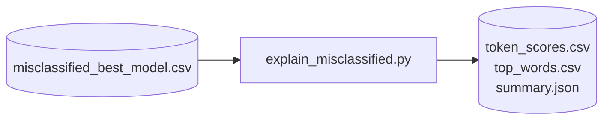

---

## evaluation/ — モデル評価・比較・検証

| ファイル | 説明 |
|---|---|
| `compare_models_ood.py` | 複数モデルのOOD性能比較（accuracy/P/R/F1・McNemar） |
| `seed_study.py` | 多シードでDAPT効果を検証（Issue#24・平均±SD＋ペア検定・代表モデル選定） |
| `validate_sentiment_english.py` | 英語100件での感情分析精度検証 |

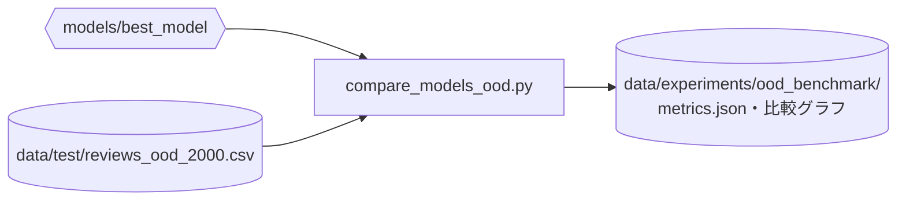

`seed_study.py` と `learning_curve_experiment.py` だけは、CSVを介さず
`train_sentiment.py` の関数を**直接呼んで**何度も学習を回します。

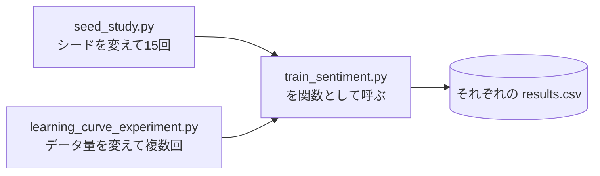

**使用方法:**
```bash
make compare-ood            # OOD性能比較
make seed-study             # 多シード検証（GPU長時間。SEEDS=15で数変更）
make seed-study-analyze     # 多シード検証の集計のみ
```

---

## learning_curve/ — データ量と精度の関係

| ファイル | 説明 |
|---|---|
| `learning_curve_experiment.py` | データ量と精度の関係を複数seedで検証 |
| `analyze_learning_curve.py` | Learning Curve実験結果の分析・可視化 |

**使用方法:**
```bash
make learning-curve                        # 10k vs 20k で比較（デフォルト）
make learning-curve SIZES="5000 10000"     # サイズを指定して比較
make analyze-curve                         # 実験結果の分析・可視化
```

---

## topic/ — トピック抽出実験

| ファイル | 説明 |
|---|---|
| `bertopic_experiment.py` | BERTopicパラメータ実験 |

---

## benchmarks/ — 性能・実行可能性の計測

GPU性能・ファインチューニング負荷・DAPTの実行可能性などを「測る」スクリプト。

| ファイル | 説明 |
|---|---|
| `gpu_benchmark.py` | GPU性能計測 |
| `benchmark_finetuning.py` | ファインチューニングのGPU負荷検証 |
| `dapt_feasibility.py` | DAPT着手前の実行可能性（メモリ・所要時間）計測 |
| `timeseries_feasibility.py` | 時系列予測着手前の実行可能性計測。レビュー発生密度・英語フィルタ通過率・自然ポジ率を実測し、集計粒度（日次/週次）と必要ゲーム数を試算（Issue #31） |
| `seasonality_check.py` | レビュー投稿数の季節性測定。複数ゲームを合算し、年ごとの月別シェアの形が繰り返されるかで年次周期の有無を判定（Issue #32 の遡る期間を決めるため） |

---

## 関連

- [../src/README.md](../src/README.md) — スクリプトが使う部品（モジュール）の一覧と依存関係
- [../tests/README.md](../tests/README.md) — テストと対象モジュールの対応
- [ドキュメントマップ](https://github.com/rindguitar/game-demand-forecast/wiki/Documentation-Map) — Wiki全体の繋がり
