# scripts/

実行スクリプト群。用途別のサブディレクトリに分類されています。

## ディレクトリ構成

```
scripts/
├── collect/            # データ収集
├── nlp/                # NLP本番実行
├── timeseries/         # 週次時系列の作成と予測
├── misclassification/  # 誤分類の分析パイプライン
├── evaluation/         # モデル評価・比較・多シード検証
├── learning_curve/     # データ量と精度の関係
├── topic/              # トピック抽出実験
└── benchmarks/         # 性能・実行可能性の計測
```

---

## 全体の流れ

大きくは4段です。詳しい図は、それぞれのディレクトリの節にあります。


```mermaid
flowchart LR
    A["collect/<br/>Steam APIから集める"] --> B["nlp/<br/>学習・トピック抽出"]
    B --> C["evaluation/<br/>精度を測る"]
    C --> D["misclassification/<br/>間違いを分析する"]
```

図の中の図形は共通で、**四角＝スクリプト / 円筒＝データ（CSV） / 六角形＝モデル** です。
矢印は「この出力が次の入力になる」という流れを表します。

---

## collect/ — データ収集

Steam APIからレビューデータを収集するスクリプト。  
収集したデータは `data/train/` に保存されます。

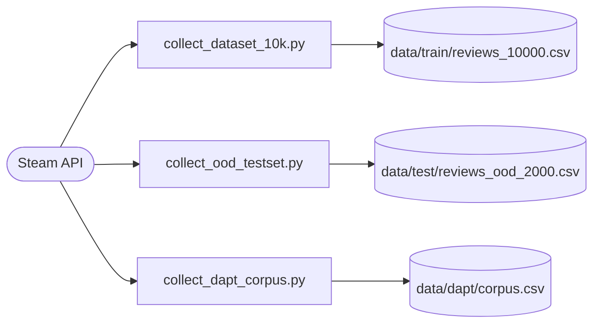
```mermaid
flowchart LR
    API(["Steam API"]) --> C1["collect_dataset_10k.py"] --> D1[("data/train/reviews_10000.csv")]
    API --> C2["collect_ood_testset.py"] --> D2[("data/test/reviews_ood_2000.csv")]
    API --> C3["collect_dapt_corpus.py"] --> D3[("data/dapt/corpus.csv")]
```

| ファイル | 説明 |
|---|---|
| `collect_dataset_10k.py` | 10000件のbalancedレビューを収集（学習用・推奨） |
| `collect_dataset_20k.py` | 20000件のbalancedレビューを収集 |
| `collect_ood_testset.py` | OOD評価用テストセット収集（未知20ゲーム・ジャンル/タグ偏り対策） |
| `collect_dapt_corpus.py` | DAPT用の未ラベルコーパス収集（多様な10万件・OOD/学習ゲーム除外） |
| `collect_timeseries_dataset.py` | 時系列予測用のレビュー収集（期間固定・自然比率・レビュー本文を保存）。母集団のメタ情報を `pool_cache.json` に貯めてから選定するため、条件を変えた選び直しは `--dry-run` で数秒。**ページ単位で追記し、中断したゲームの途中から再開できる**（`--progress-output`）。Issue #32 |
| `inspect_timeseries_dataset.py` | 収集した時系列データの偏り点検（収集の網羅性・自然比率・ゲーム別シェア・ジャンルの本数/量の乖離・参加ゲーム数の推移）。APIを叩かずCSVだけ読む |

**時系列収集は途中から再開できます**（`collect_timeseries_dataset.py`）

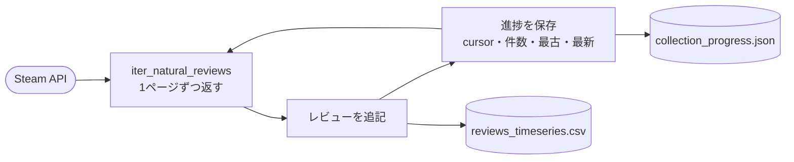
```mermaid
flowchart LR
    API(["Steam API"]) --> IT["iter_natural_reviews<br/>1ページずつ返す"]
    IT --> AP["レビューを追記"]
    AP --> SP["進捗を保存<br/>cursor・件数・最古・最新"]
    SP --> IT
    SP --> PJ[("collection_progress.json")]
    AP --> RV[("reviews_timeseries.csv")]
```

**追記 → 進捗保存の順を守ります。** 逆にすると、その間に落ちたときページが1つ抜けたまま
「取り切った」ことになり、後から気づけません。逆にこの順なら、落ちて生じるのは重複だけで、
再開時に進捗の件数まで切り詰めれば正確に直ります。

中断は安全です（`Ctrl+C` でも `kill` でも可）。同じコマンドをもう一度実行すれば、
**そのゲームの途中から**続きます。取り切ったゲームだけ進捗を捨てるので、
未達のまま先頭に戻されることはありません。

**ロスターは既存を固定したまま足せます**（`--extend`）。

```bash
# 既存の台帳を変えずに、合計79本になるまで追加する
make collect-timeseries COLLECT_ARGS="--extend --n-games 79 --max-per-genre 40 --max-backbone 58"
```

3つの条件（ジャンルの下限・上限、土台の上限、タグ重なり）は既存分も数えて判定するので、
既存と似たゲームは入りません。**条件は緩める方向にしか動かさない限り、足すのは常に追加になります**
（厳しい条件を満たす集合は緩い条件も満たすため）。後から緩めても、集めたレビューは無駄になりません。

⚠️ `--reselect` は顔ぶれを選び直すので、収集済みのゲームが入れ替わります。足すときは `--extend` を使ってください。

条件を変えて顔ぶれだけ見るときは `--dry-run` を付けます（APIを叩かないので数秒・台帳は変わりません）。

```bash
docker compose exec dev python scripts/collect/collect_timeseries_dataset.py \
    --dry-run --reselect --max-backbone 12
```

⚠️ **消してはいけないファイルが2つあります。**

- `data/timeseries/reviews_timeseries.csv` — **唯一の再現不能な資産**。レビュー本文があるので、トピックの作り方を変えても遡って作り直せる
- `data/timeseries/pool_cache.json` — 母集団497本のメタ情報。消すと選定に15〜20分かかる

**使用方法:**
```bash
make collect-10k           # 10000件（学習用）
make collect-ood           # OODテストセット
make collect-dapt-corpus   # DAPT用コーパス（10万件・未ラベル）
```

---

## nlp/ — NLP本番実行

感情分析モデルの学習とトピック抽出の本番実行スクリプト。  
通常は `make` コマンド経由で実行します。

**感情分析モデルができるまで**（左から順に実行する）

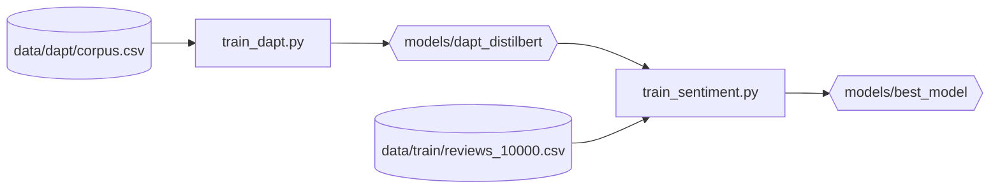
```mermaid
flowchart LR
    D3[("data/dapt/corpus.csv")] --> T1["train_dapt.py"] --> M1{{"models/dapt_distilbert"}}
    M1 --> T2["train_sentiment.py"] --> M2{{"models/best_model"}}
    D1[("data/train/reviews_10000.csv")] --> T2
```

`train_dapt.py` が作るのは「Steamの言い回しに慣れただけ」のモデルで、まだ感情は判定できません。
それを土台に `train_sentiment.py` で微調整して、本番モデル `models/best_model` になります。

**トピック抽出と仕分け**（上とは独立に動く）

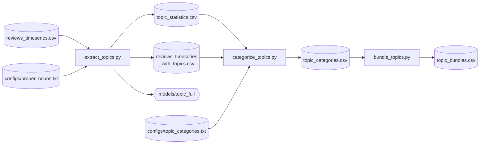
```mermaid
flowchart LR
    R[("reviews_timeseries.csv")] --> E["extract_topics.py"]
    P[("configs/proper_nouns.txt")] --> E
    E --> W[("reviews_timeseries<br/>_with_topics.csv")]
    E --> S[("topic_statistics.csv")]
    E --> M{{"models/topic_full"}}
    S --> C["categorize_topics.py"]
    W --> C
    V[("configs/topic_categories.txt")] --> C
    C --> O[("topic_categories.csv")] --> B["bundle_topics.py"]
    B --> N[("topic_bundles.csv")]
```

`extract_topics.py` は「どんな話題があるか」を出すところまで。
`categorize_topics.py` がそれを ①ゲーム要素 / ②品質・運営 / ③ビジネス条件 / 中身なし に仕分けます。
**①は語彙に当たって初めて①になります**（残余ではありません）。どこにも当たらないものは
**未分類**に落ちて需要スコアの対象から外れます。①の語彙は `update_element_vocabulary.py` が
母集団のSteamタグから自動生成するので、手で書き足す必要はありません。どのタグを①にするかの
判定は `configs/steam_tags.txt` に1つだけ置く（開発規模・販売形態等の「中身を表さないタグ」と、
Addictive等の「遊んだ結果の感想」は①にしない）。判定の無い新しいタグが母集団に出ると
`element_tags()` が止まるので、その場合はこのファイルに追記する。

①の証拠は**語の一致だけでなく「タグとの意味の近さ」でも受け取ります**。
`Souls-like` と `soulslike`、`Difficult` と `hard` は文字列では別物ですが、意味では同じです。
閾値は `--strong-element`（既定0.65・これ以上で①に確定）と
`--weak-element`（既定0.50・これ以上で1票）で変えられます。
需要スコアに合算するのは①だけで、③は阻害要因として別枠に持ちます（`docs/decisions.md` 2026-08-18）。

近さを測って仕分けるまでは `classify_with_evidence()`（`src/nlp/topic_category.py`）1つに閉じていて、
`compare_topic_granularity.py` と `build_topic_cooccurrence.py`（束ねたとき）も同じ入口を通ります。
**証拠は省略できません**。省略できると、文字の一致だけの古い規則に黙って戻るためです（`docs/decisions.md` 2026-09-27）。

`bundle_topics.py` は、週10件に届かない小さいトピックだけをSteamタグの語彙に寄せます。
大きいトピックはそのまま残し、タグに寄らないものは「その他」に集約します（`docs/decisions.md` 2026-08-31）。

`categorize_topics.py` と `bundle_topics.py` は上図のほかに `data/timeseries/games.csv` も読みます
（前者は土台パネルの顔ぶれを `tier` 列と発売日から、後者は束ね先の語彙をジャンル列・タグ列から取るため）。
`categorize_topics.py` はさらに `data/timeseries/collection_log.csv`（全ゲームの収集がそろう期間を出すため。
→ 下の「timeseries/」の節）、`data/timeseries/pool_cache.json`（①の語彙にするSteamタグ）と、
その判定ファイル `configs/steam_tags.txt`（既定値・`element_tags()` が読む）も読みます。
週あたり件数は、この共通の期間に絞ったレビューで測ります。
`--collection-log` / `--min-weeks-since-release` / `--exclude-game`（既定は外さない）で変えられます。
表示する内訳の件数・割合・到達率は、どれもトピック統計の件数（全期間）を出どころにするので、
割合の合計は100%になります（期間内で数えた件数を分母に混ぜない）。

**粒度を粗くして比べる**（抽出済みのモデルだけで動く・再学習しない）

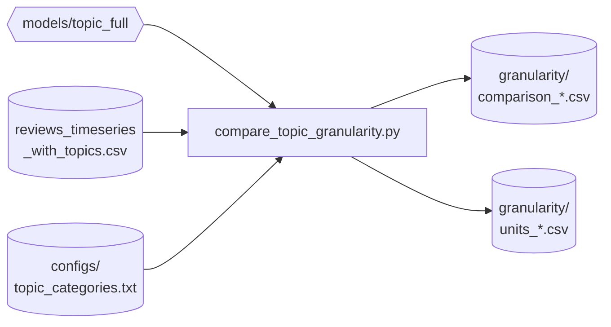
```mermaid
flowchart LR
    M2{{"models/topic_full"}} --> G["compare_topic_granularity.py"]
    W2[("reviews_timeseries<br/>_with_topics.csv")] --> G
    V2[("configs/<br/>topic_categories.txt")] --> G
    G --> CP[("granularity/<br/>comparison_*.csv")]
    G --> UN[("granularity/<br/>units_*.csv")]
```

`compare_topic_granularity.py` は455トピックをマージ木にまとめ、200個 / 100個 ... と切りながら
どのレベルでも同じ物差しで測って並べます。トピックの目標粒度を決めるための材料で
（Issue #37）、日々のパイプラインには入りません。物差しの中身は `--help` を参照。

上図のほかに `pool_cache.json` と、その判定ファイル `configs/steam_tags.txt`（既定値）も読みます
（各レベルの単位を `classify_with_evidence()` で仕分けるため）。
さらに `games.csv` と `collection_log.csv` から、共通の期間と土台のゲームを決めます
（`categorize_topics.py` と同じ定義・同じ引数）。密度と混入率は、この期間に絞ったレビューで測ります。
複数のレベルを仕分けるので、埋め込みモデルは1回だけ読んで使い回します。

細かい側（トピックを増やす方向）はこの方法では作れません。`extract_topics.py` を
`--min-topic-size` を下げて回し直す必要があります。

**ゲーム単位の共起を出す**（どの部品が同じゲームに同居しているか）

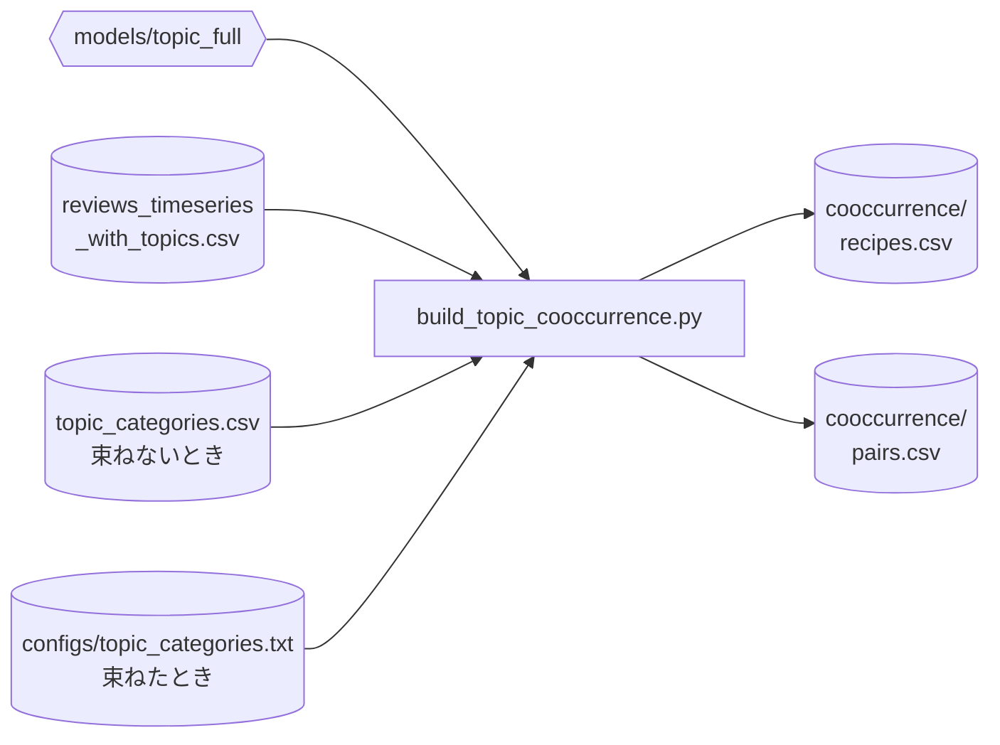
```mermaid
flowchart LR
    M3{{"models/topic_full"}} --> CO["build_topic_cooccurrence.py"]
    W3[("reviews_timeseries<br/>_with_topics.csv")] --> CO
    C3[("topic_categories.csv<br/>束ねないとき")] --> CO
    V3[("configs/topic_categories.txt<br/>束ねたとき")] --> CO
    CO --> RE[("cooccurrence/<br/>recipes.csv")]
    CO --> PA[("cooccurrence/<br/>pairs.csv")]
```

`build_topic_cooccurrence.py` は「そのゲームらしさ（リフト）」でゲームごとのレシピを作り、
同じレシピに入った部品のペアを数えます（Issue #42）。**出現では測りません** ——
素朴に「同じゲームに出るか」で数えるとほぼ全結合になり情報にならないからです
（24本・300単位での実測: 時系列に乗る35単位のうち21個が全24本に出ました）。

**単位の仕分けは、束ねるかどうかで出どころが変わります。** 判定は `--level` の数値ではなく、
単位の中身（全単位がトピック1個だけか）で行います。

- **束ねない**（64本モデルなら `--level 526`）: `categorize_topics.py` が出した `topic_categories_*.csv` を
  `--categories-csv` で渡し、トピックの分類をそのまま単位に当てます。**渡さないと止まります**。
  CSVに無いトピックがあっても、既定値で埋めずに止まります。共起の側で仕分け直すと、
  需要スコアが使う公式の仕分けと食い違う単位が出るためです
  （`wife, partner, girlfriend…` は、公式では未分類なのに共起の仕分けでは①になっていた）。
  この場合、`configs/topic_categories.txt`（分類語彙）も `pool_cache.json` も読みません
- **束ねた**（既定の300など）: トピック単位の分類は複数トピックの束に当てられないので、
  単位のキーワードを `classify_with_evidence()` にかけてその場で仕分けます。
  上図のほかに `pool_cache.json` と、その判定ファイル `configs/steam_tags.txt`（既定値）も読みます。
  **`--categories-csv` を渡すと止まります**

64本・束ねないときの実行例:

```bash
docker compose exec dev python scripts/nlp/build_topic_cooccurrence.py \
    --model models/topic_64 --reviews data/timeseries/reviews_timeseries_with_topics_64.csv \
    --level 526 --categories-csv data/timeseries/topic_categories_64.csv \
    --outdir data/timeseries/cooccurrence_64
```

**レシピに残すのは①②③だけ**で、中身なし・固有名詞・未分類・要手動判定は外します（`--keep-noise` で外さない）。

⚠️ **ペアの通り数に対してゲームが少ないと、「このペアが無い = 未開拓」は言えません。**
除外後に残った単位が n 個ならペアは n×(n-1)/2 通りあり、実行の最後に実際のゲーム数と通り数を出します。
読めるのはレシピと、観測された共起までです。

**供給側のタグが代用になるか検証する**

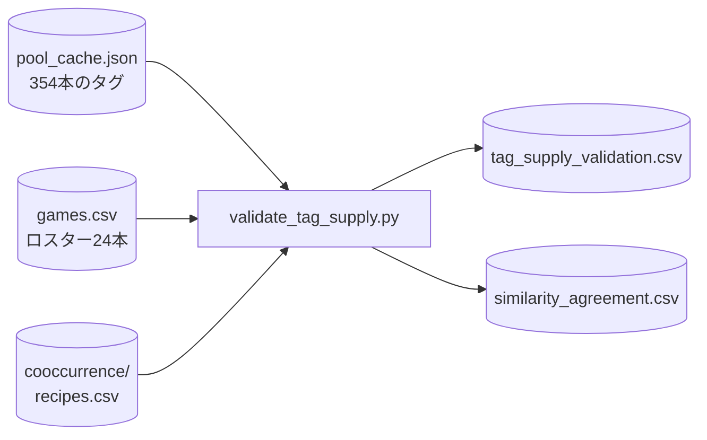
```mermaid
flowchart LR
    PC[("pool_cache.json<br/>354本のタグ")] --> VT["validate_tag_supply.py"]
    GC[("games.csv<br/>ロスター24本")] --> VT
    RC[("cooccurrence/<br/>recipes.csv")] --> VT
    VT --> TV[("tag_supply_validation.csv")]
    VT --> SA[("similarity_agreement.csv")]
```

`validate_tag_supply.py` は2つ測ります。**検証1**は同じ24本で「タグで測ったゲームの似方」と
「トピックで測った似方」を相関させ、タグが同じ構造を捉えているかを見ます。
**検証2**は `24本×トピック / 24本×タグ / 354本×タグ` を並べ、
効いているのが語彙なのかサンプル数なのかを分離します。

⚠️ 検証1は標本が要ります。`build_topic_cooccurrence.py --min-lift 1.0` で厚くしたレシピを
`--recipes` に渡してください。既定のレシピ（リフト2倍以上）だと重なりが足りず判定不能になります。

| ファイル | 説明 |
|---|---|
| `train_sentiment.py` | DistilBERTの感情分析モデル学習（本番・実験兼用） |
| `train_dapt.py` | DAPT（未ラベルレビューでMLM継続学習・ドメイン適応モデル作成） |
| `extract_topics.py` | BERTopicによるトピック抽出（本番実行） |
| `categorize_topics.py` | トピックの仕分け（①要素 / ②品質・運営 / ③ビジネス条件 / 中身なし / 固有名詞） |
| `bundle_topics.py` | 小さいトピックをSteamタグの語彙に束ねる |
| `compare_topic_granularity.py` | 粒度を粗い側へ動かし、レベルごとに同じ物差しで測って比べる（Issue #37） |
| `build_topic_cooccurrence.py` | ゲームごとのレシピと、部品ペアの共起を出す。束ねないときは公式の分類CSV（`--categories-csv`）を使う（Issue #42） |
| `validate_tag_supply.py` | 供給側のタグがロスター拡大の代用になるか検証する（Issue #42） |
| `update_element_vocabulary.py` | ①ゲーム要素の語彙を母集団のSteamタグから作り直す。除くタグの判定は `configs/steam_tags.txt`（Issue #45） |

**使用方法:**
```bash
make train-sentiment       # vanillaベースライン（best_model_pre_dapt上書き）
make train-dapt            # DAPT（MLM継続学習・要コーパス）
make train-sentiment-dapt  # DAPT baseで微調整（best_model上書き・本番）
make train-test            # パイプライン確認用（短時間）
make extract-topics        # トピック抽出
make compare-granularity   # 粒度レベルの比較（再学習しない）
```

`make extract-topics` は既定値で回します。本番の設定は次のとおりです。
出力は既定で上書きされる（`reviews_timeseries_with_topics.csv` / `topic_statistics.csv`）ので、残したいときは
`--output` / `--stats-output` / `--model-output` を別名にします（64本の本番は `_64` 付きの名前・`models/topic_64`）。

```bash
docker compose exec dev python scripts/nlp/extract_topics.py \
    --input data/timeseries/reviews_timeseries.csv \
    --sample-per-game 5000 --fit-sample-size 100000 \
    --skip-english-filter --remove-all-game-names \
    --model-output models/topic_full
```

`train_sentiment.py` は `scripts/learning_curve/learning_curve_experiment.py` と `scripts/evaluation/seed_study.py` からもimportされます。

---

## timeseries/ — 週次時系列の作成と予測（Phase 6〜7）

仕分け済みのトピックから、週次の時系列データを作ります（Phase 6）。
そのシェアを Prophet で予測して、単純な予測と比べます（Phase 7・下の「予測と評価」）。

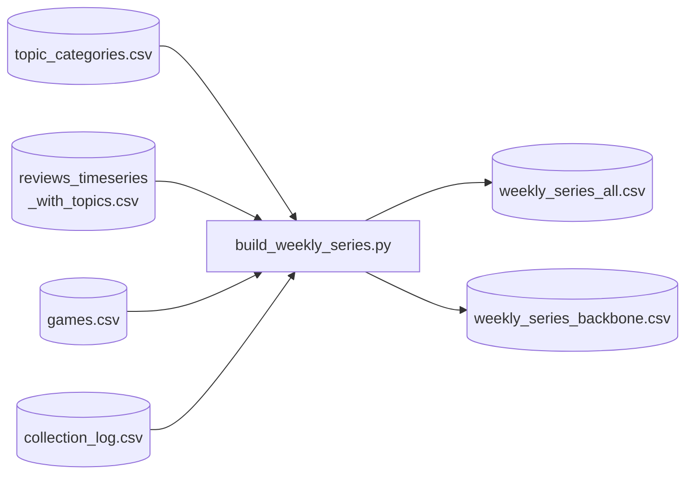
```mermaid
flowchart LR
    O[("topic_categories.csv")] --> S["build_weekly_series.py"]
    W[("reviews_timeseries<br/>_with_topics.csv")] --> S
    G[("games.csv")] --> S
    L[("collection_log.csv")] --> S
    S --> A[("weekly_series_all.csv")]
    S --> B[("weekly_series_backbone.csv")]
```

パネルを2枚作ります（`docs/decisions.md` 2026-09-05）。

| パネル | 顔ぶれ | 使い方 |
|---|---|---|
| `backbone` | tier が土台で、発売が期間開始の26週以上前のゲーム | **絶対数**で引ける。主軸 |
| `all` | 全ゲーム | 参加ゲームが入れ替わるので**シェア**で見る |

本数は台帳と収集ログから決まります（24本のときは土台13本・全24本、64本では土台36本・全64本）。
出力は `weekly_series_backbone.csv` / `weekly_series_all.csv` です（`plot_weekly_series.py` も同じ名前を読みます）。

**期間と土台は、収集ログと台帳から機械的に決めます**（日付・本数は手で書かない。→ `docs/decisions.md` 2026-10-01）。
`build_weekly_series.py` / `categorize_topics.py` / `compare_topic_granularity.py` の3本が、
`src/timeseries/weekly.py` の **`decide_window_and_backbone()` 1つ**を呼んで決めます
（台帳と収集ログを渡すと `(期間, 土台, 外れたゲーム)` が返り、画面の表示文も
`describe_window_and_backbone()` で3本とも同じになります）。中身は次の2つです。

- **期間** = `common_window()`。tier が土台のゲームの収集ログ（`collection_log.csv` の oldest / newest）から、
  全ゲームの収集がそろう範囲を出す。最も遅い oldest と最も早い newest を含む週は、途中までしか
  集めていないので使わない（64本では 2023-09-25〜2026-08-24 の153週）
- **土台** = `select_backbone()`。tier が土台で、発売が期間開始の26週以上前のゲーム
  （`--min-weeks-since-release`・既定は `MIN_WEEKS_SINCE_RELEASE`）。発売日が読めなければ止まる。
  Starfield を手書きで外すのはやめた（期間開始の3週前の発売なので、この規則で外れる）。
  手で外したいときだけ `--exclude-game`（既定は外さない）

3本とも、この期間のレビューだけで測ります（物差しを1本にするため）。密度を測る
`measure_topic_panels()` は期間を省略できず、`build_weekly_series.py` は `trim_to_window()` で絞ります。
`--collection-log`（既定 `data/timeseries/collection_log.csv`）と `--min-weeks-since-release` も3本とも同じです。

出力は縦長で、1行が「単位 × 週」です。列は `count`（言及数）/ `share`（その週の総言及数に対する割合）/
`positive_rate`（ポジ率）/ `expected_positive_rate`（ゲーム構成から期待されるポジ率）/
`positive_rate_gap`（その差＝充足度）/ `games`（参加ゲーム数）/ `total`（その週の総言及数）。

充足度は**差で見ます**。`voted_up` はゲーム全体への評価なので、絶対値だとそのトピックが
どのゲームの話かを読んでしまいます（→ `docs/decisions.md` 2026-09-07）。

| ファイル | 説明 |
|---|---|
| `build_weekly_series.py` | 週次時系列の作成と、系列の健全性の点検 |
| `plot_weekly_series.py` | 折れ線グラフの作成（`data/timeseries/plots/`） |
| `forecast_prophet.py` | 週次シェアを Prophet で予測し、比べる相手（学習期間の平均・直近の平均）と当たり具合を比べる（`data/timeseries/forecast_64/`）。`--launch-events` で発売を出来事として渡す（`forecast_64_launch/`）。`--launch-steps` で発売を水準の段差としても渡す（`forecast_64_launch_step/`）。`--tune` でテスト期間を見ずに Prophet の設定を選ぶ（`forecast_64_tuned/`）。Issue #41・#60 |

**使用方法:**
```bash
docker compose exec dev python scripts/timeseries/build_weekly_series.py
docker compose exec dev python scripts/timeseries/plot_weekly_series.py
make forecast-prophet      # 予測と評価。引数は FORECAST_ARGS で渡す
make forecast-prophet FORECAST_ARGS="--launch-events"   # 発売を出来事として渡す
make forecast-prophet FORECAST_ARGS="--launch-steps"    # 発売を水準の段差としても渡す
make forecast-prophet FORECAST_ARGS="--tune"            # 確かめ用の期間で Prophet の設定を選ぶ
```

**64本（いまの本番）で回すとき**。スクリプトの既定値は24本版のファイルを指しているので、64本は引数で渡します
（既定値を直す件は Issue #56）。⚠️ `categorize_topics.py` は **`--output` を必ず付けてください**。
省くと24本版の `topic_categories.csv` を上書きします。

```bash
docker compose exec dev python scripts/nlp/categorize_topics.py \
    --stats data/timeseries/topic_statistics_64.csv \
    --reviews data/timeseries/reviews_timeseries_with_topics_64.csv \
    --output data/timeseries/topic_categories_64.csv
docker compose exec dev python scripts/timeseries/build_weekly_series.py \
    --categories-csv data/timeseries/topic_categories_64.csv \
    --reviews data/timeseries/reviews_timeseries_with_topics_64.csv \
    --output-dir data/timeseries/weekly_64
docker compose exec dev python scripts/timeseries/plot_weekly_series.py \
    --input-dir data/timeseries/weekly_64 --output-dir data/timeseries/weekly_64/plots
```

期間と土台は、3本とも `collection_log.csv` と `games.csv` から自動で決まります。

図は1枚に線を重ねず、系列ごとに小さい図を並べます（`.claude/rules/mermaid.md` の
「1枚の線を減らす」と同じ理由）。コンテナに日本語フォントが無いのでラベルは英語です。

### 予測と評価 — forecast_prophet.py（Phase 7）

全64本の中での週次シェア（`weekly_series_all.csv` の `share`）を、トピック（単位）ごとに Prophet で予測し、
**単純な予測より当たるか**を測ります（Issue #41。シェアを予測する理由は `docs/decisions.md` 2026-10-03）。

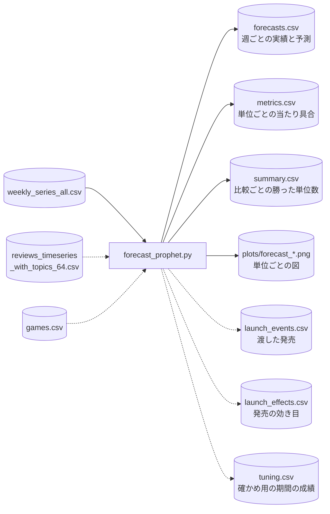
```mermaid
flowchart LR
    W[("weekly_series_all.csv")] --> F["forecast_prophet.py"]
    R[("reviews_timeseries<br/>_with_topics_64.csv")] -.-> F
    G[("games.csv")] -.-> F
    F --> FC[("forecasts.csv<br/>週ごとの実績と予測")]
    F --> MT[("metrics.csv<br/>単位ごとの当たり具合")]
    F --> SM[("summary.csv<br/>比較ごとの勝った単位数")]
    F --> PL[("plots/forecast_*.png<br/>単位ごとの図")]
    F -.-> LE[("launch_events.csv<br/>渡した発売")]
    F -.-> LF[("launch_effects.csv<br/>発売の効き目")]
    F -.-> TN[("tuning.csv<br/>確かめ用の期間の成績")]
```

点線は `--launch-events` を付けたときだけ読む入力・書く出力です（下の「発売を出来事として渡す」）。
`launch_effects.csv` は `--launch-steps` のときだけ書きます（下の「発売を段差の印としても渡す」）。
`tuning.csv` は `--tune` のときだけ書きます（下の「確かめ用の期間で設定を選ぶ」）。

**評価のしかた**

- **切り方**: 全単位で同じ週で切ります。最後の26週（`--test-weeks`）をテスト、その前（64本では127週）を学習にします。
  `share` が欠測の行は、学習・テストとも除きます
- **予測する4つの方法**: Prophet（年次季節性あり）／Prophet（年次季節性なし）／
  比べる相手①「学習期間の平均」／比べる相手②「直近の平均」（学習期間の最後の4週・`--recent-weeks`）。
  Prophet は年次季節性の有無だけを変え、ほかは既定値のままです（`--tune` のときだけ、曲がりやすさと季節性の効き具合も変えます）。比べる相手も Prophet と同じ学習期間から作ります
  （発売の山やセールの週も除きません。ただし `--launch-events` のときは、渡した発売の週だけ除きます。`--launch-steps` のときは、最新の発売の後の週だけで作ります）
- **当たり具合**: テスト期間の MAE（予測と実績の差の絶対値の平均）を、4つの方法それぞれで出します
- **比**: `MAE(Prophet) ÷ MAE(比べる相手)`。**1未満なら Prophet の勝ち**です（ちょうど1や欠測は勝ちにしません）。
  次の2×2の4通りを、勝った単位数・全単位数・比の中央値にまとめます（`summary.csv`）

| | 比べる相手① 学習期間の平均 | 比べる相手② 直近の平均 |
|---|---|---|
| **Prophet（年次季節性あり）** | `ratio_prophet_yearly_vs_baseline_mean` | `ratio_prophet_yearly_vs_baseline_recent` |
| **Prophet（年次季節性なし）** | `ratio_prophet_no_yearly_vs_baseline_mean` | `ratio_prophet_no_yearly_vs_baseline_recent` |

- Prophet の予測が負になっても**クリップしません**。負になった数だけ画面に出します

**出力**（既定は `data/timeseries/forecast_64/`。`--launch-events` のときは `data/timeseries/forecast_64_launch/`、`--launch-steps` のときは `data/timeseries/forecast_64_launch_step/`、`--tune` のときは `data/timeseries/forecast_64_tuned/`）

| ファイル | 中身 |
|---|---|
| `forecasts.csv` | 縦長。`unit, week, split（train / test）, actual, prophet_yearly, prophet_no_yearly, baseline_mean, baseline_recent`。予測の列はテスト週だけ値が入り、学習週は空 |
| `metrics.csv` | 1行1単位。`unit, category, keywords`、4つの MAE（`mae_<方法>`）、4つの比（`ratio_<Prophet>_vs_<比べる相手>`） |
| `summary.csv` | 4通りの比較ごとに、勝った単位数（`wins`）・全単位数（`units`）・比の中央値（`median_ratio`） |
| `launch_events.csv` | `--launch-events` のときだけ。選んだ（単位, 発売）の組。`unit, game, release_week, game_mentions, unit_mentions, share` |
| `launch_effects.csv` | `--launch-steps` のときだけ。Prophet の型（年次季節性あり・なし）ごとの、（単位, 発売）ごとの効き目。`prophet, unit, keywords, game, release_week, has_step, spike_peak, step_size` |
| `tuning.csv` | `--tune` のときだけ。確かめ用の期間での、Prophet の型 × 設定ごとの成績。`prophet, changepoint_prior_scale, seasonality_prior_scale（年次季節性なしは空）, units（数えた単位数）, wins_baseline_mean, wins_baseline_recent, min_wins, median_ratio_baseline_mean, median_ratio_baseline_recent, selected`。型ごとに選ぶ順に並び、選んだ設定の行だけ `selected` が True |
| `plots/forecast_01.png` ほか | 単位ごとの小さい図を、30単位ずつ並べる。学習期間の最後の52週（`--plot-weeks`）の実績（灰）、テスト期間の実績（黒）、4つの予測、テスト開始の縦線。ラベルは英語。`--no-plot` で省く |

**発売を出来事として渡す（`--launch-events`）**

年次季節性は、去年1回きりの発売の山を「毎年の山」として覚えて、1年後に再生します
（例: t2 の Blue Prince の山を、1年後の4〜5月に再生）。そこで発売を Prophet の
holidays（出来事）として渡し、山を「発売のせい」と学ばせます。

- **対象の発売**: 発売週（発売日を含む週の月曜）から8週（`--launch-weeks`）が、データ期間の最初の週以降と
  重なり、かつ発売週が切る週より前のもの。期間の直前に出たゲームも入ります（64本では25本）。
  台帳（`--games`）の発売日が読めなければ止まります
- **選び方**: 発売ごとに「確かめる期間」（発売週から8週。**切る週より前で打ち切る**ので、テスト期間のレビューは
  使いません）を決め、その中で単位ごとに数えます。次の2つを**両方**満たす（単位, 発売）の組を選びます
  - 割合: その単位の全レビューのうち、そのゲームのレビューが 0.5 以上（`--launch-min-share`。ちょうど0.5も含む）
  - 件数: そのゲームのレビューが 週10件（`--launch-min-weekly`）× 確かめる期間の週数 以上
    （打ち切りで週数が減ったら、その週数で掛ける）
- **渡し方**: 単位ごとに、選んだ発売を holidays にします（`holiday` = ゲーム名で発売ごとに別の出来事、
  `ds` = 発売週、`lower_window` = 0、`upper_window` = 7×(8−1) 日）。年次季節性の切り替えなどは変えません。
  **発売が付かない単位には holidays を渡さない**ので、`--launch-events` なしと同じ結果になります
- **比べる相手にも同じ情報**: 発売が付く単位では、学習期間から「渡した発売の、発売週から8週」を除いて、
  学習期間の平均・直近の平均を出します（直近は除いた後の最後の4個）。Prophet には除かない学習期間をそのまま渡します。
  除くと実績が1つも残らなければ止まります
- **読むファイル**: `--reviews`（既定 `reviews_timeseries_with_topics_64.csv`。726MBあるので `game_name` /
  `timestamp_created` / `topic_id` の3列だけ読む）と `--games`（既定 `games.csv`）
- **画面と出力**: 対象の発売の数・選んだ組の数・発売が付いた単位／付かなかった単位の数を表示し、
  選んだ組を `launch_events.csv` に書きます。図には、その単位に渡した発売の週を細い点線で引きます
  （図の範囲に入るものだけ・凡例は "Launch week"）。
  出力先は既定で `forecast_64_launch/` で、発売を渡さない結果（`forecast_64/`）は上書きしません

**発売を段差の印としても渡す（`--launch-steps`）**

発売は、一時的な山だけでなく、**水準そのものを押し上げたまま残す**ことがあります（例: t2 の Blue Prince）。
山の印（holidays）は「8週たてば元に戻る」と教えるので、残った分を取りこぼします。そこで発売を
水準の段差としても渡します（Issue #60。`--launch-events` も有効になります）。

- **段差の印**: `--launch-events` と同じ選び方で選んだ（単位, 発売）の組のうち、**発売週がその単位の学習期間の
  最初の週より後**のものに付けます（発売前の週が学習期間に無いと、印がずっと1になって段差を学べないため。
  期間の直前に出たゲーム〔Starfield など〕は山の印だけ）。印は週ごとの 0/1 の列で、**発売週より前は0、
  発売週から後はずっと1**（予測する未来の週も1）。Prophet に `add_regressor` で渡します
  （列名は `step_0`, `step_1` …。prior_scale・standardize は既定のまま）。山の印はそのまま残すので、
  発売直後の8週は「段差＋山」、その後は「段差だけ」になります。年次季節性の切り替え、学習の打ち切りと
  Newton 法での学び直し（同じ説明変数を渡す）は変わりません
- **比べる相手にも同じ情報**: 発売が付く単位では、学習期間の平均を、渡した発売のうち**いちばん新しい発売の
  「発売週から8週」が終わった次の週から、学習期間の最後まで**の週で出します（予測したいテスト期間は
  段差の印が1の状態なので、発売前の週は「いまのふだんの高さ」を表さないため）。直近の平均は、その週の
  最後の4個です。段差の印を付けなかった発売（期間の直前の発売）も、この判定に含めます。その週が1つも
  無ければ止まります。発売が付かない単位は、`--launch-events` なしと同じです
- **`launch_effects.csv`**: 1行が（Prophet の型, 単位, 発売）。`has_step` は段差の印を付けたか、
  `spike_peak` はその発売の山の印の効き目の最大値（学習期間の当てはめで、8週の窓の中の holidays の成分の
  最大値）、`step_size` は段差の印の係数（段差の印が無い発売は空）。単位はどちらもシェア（0〜1）です
- **勝ちの基準の判定**: 画面の summary の後に、Prophet の型ごとに「比べる相手2つの**両方**に 40 / 59 単位以上で
  勝ったか」を出します（ちょうど40は届いた扱い。片方の相手にしか届かなければ届かない）。
  基準の数は `--win-criterion`（既定は `src/timeseries/forecast.py` の `WIN_CRITERION_UNITS` = 40）
- **画面と出力**: 段差の印を付けた組・付けなかった組の数も表示します。出力先は既定で
  `forecast_64_launch_step/` で、`--launch-events` の結果（`forecast_64_launch/`）は上書きしません。
  図は `--launch-events` と同じです

**確かめ用の期間で設定を選ぶ（`--tune`）**

Prophet の設定はここまで既定値のままでした。`--tune` は、**テスト期間を見ずに**設定を選びます
（Issue #60 ②。`--launch-steps` も有効になります）。テストを見て選ぶと「テストに合わせた設定」になり、測り直しにならないためです。

- **確かめ用の期間**: 学習期間（64本では127週）を、前の101週（**学ぶ期間**）と、後ろの26週（**確かめ用の期間**・
  `--validation-weeks`）に分けます。確かめ用の期間を「テスト」と見なして `--launch-steps` と同じ形で予測し、
  比べる相手と比べます。**テスト期間のデータは一切使いません**（テストの切る週より前の行だけを残してから分けます）
- **発売も選び直す**: 切る週を確かめ用の期間の最初の週にして選び直します（その週以降のレビュー・発売は数えない。
  確かめ用の期間の頭に出た Silksong・Borderlands 4 は対象外）。比べる相手も、学ぶ期間から同じ規則で作ります

試す設定（ほかの設定は既定値のまま）:

| 設定 | 試す値（既定） | 引数 |
|---|---|---|
| `changepoint_prior_scale`（トレンドの曲がりやすさ） | 0.001・0.01・0.05・0.5 | `--cps-grid` |
| `seasonality_prior_scale`（季節性の効き具合） | 0.01・0.1・1・10 | `--sps-grid` |

年次季節性ありの型は 4 × 4 = 16通りです。**年次季節性なしの型は季節性が無いので、曲がりやすさの4通りだけ**です
（Prophet の既定値は 0.05 と 10）。

- **選び方**: 型ごとに、全単位で確かめ用の期間を予測し、比べる相手2つそれぞれに勝った単位数を数えて、次の順で1つ選びます
  1. 2つの勝ち数の**小さい方（min）が最も大きい**（勝ちの基準「両方に40以上」と同じ向き）
  2. 同点なら、2つの比の中央値の平均が小さい
  3. それでも同点なら、既定値に近い（既定値との比の対数で測る）。それでも同点なら、表で先の方
- **設定は全単位で1つ**: 確かめ用の期間は26週の1回きりなので、単位ごとに16通りから選ぶと、
  「たまたま当たった設定」を選んでしまうためです
- **比べる相手を作れない単位は外す**: 最新の発売の窓（発売週から8週）が学ぶ期間の終わりまで続く単位は、
  その後の週が無く比べる相手を作れないので、設定を選ぶ段階から外します（64本では、2025-07-28 発売の Grounded 2 が
  最新の t3・t22・t113 で、56単位で選びます。画面に外した単位を出します）。最後の測定には全単位を使います
- **Prophet のログ**: 学ぶ期間は700日で、Prophet が年次季節性に勧める730日より短いので、年次季節性ありの学習のたびに
  警告が出ます。極端な設定では Stan の L-BFGS が異常終了し、Prophet 自身が Newton 法に切り替えるログも出ます。
  設定を選ぶ段階では、同じ内容のログを最初の1回だけ表示し、回数を最後にまとめて出します
  （10秒の打ち切りによる Newton 法への切り替えは別で、これまでどおり単位つきの ⚠️ と回数を出します）
- **最後に1回だけテスト期間を測る**: 型ごとに選んだ設定で、127週（学習期間の全部）から学び直してテスト期間を予測します。
  発売の選び方・比べる相手・`launch_effects.csv`・図・勝ちの基準の判定は `--launch-steps` と同じです
- **画面と出力**: 確かめ用の期間の表（型ごとに選ぶ順・`*` が選んだ設定）→ 選んだ設定 → テスト期間の summary →
  勝ちの基準の判定。出力先は既定で `forecast_64_tuned/` で、`--launch-steps` の結果は上書きしません。
  学習の回数が多い（単位 × 20通り ＋ 最後の学び直し）ので、64本・既定の設定で約6〜7分かかります（`--launch-steps` は約30秒）

このスクリプトの既定値（`--input`・`--output-dir`）は**64本のファイルを指します**。
ほかの timeseries スクリプトは24本版を指したままです（Issue #56）。

**Prophet の注意点（学習が終わらないことがある・結果が入力の最後の桁で動く）**:
Prophet が使う Stan の最適化（L-BFGS）が、ごく稀に終わらなくなります。入力の数値の最後の桁が違うだけで
起きたり起きなかったりします（実測: 64本・テスト26週で、`share` を pandas の既定の読み方で読むと118回の学習のうち
1回〔unit 27 の年次季節性なし〕、このスクリプトの読み方〔`float_precision='round_trip'`〕では0回）。
起きると乱数の種を変えても止まり、何分待っても返りません。
そこで1回の学習を10秒（`src/timeseries/forecast.py` の `FIT_TIMEOUT_SECONDS`）で打ち切り、
**その学習だけ** Newton 法（Prophet が学習データ100点未満で既定に使う方法）で学び直して、画面に ⚠️ を出します。
ほかの学習は Prophet の既定のままです。打ち切るとき cmdstanpy の ERROR 行（`code '-15'`）が1行出ますが、
異常ではなく打ち切りの印です。

同じ理由で、Prophet の予測は入力の最後の桁の違いでも動きます（実測: 単位ごとの比で最大1割ほど。
勝敗は変わらず、中央値は0.03以内）。同じ入力なら毎回まったく同じ結果になります。

---

## misclassification/ — 誤分類の分析パイプライン

誤分類を「抽出 → タグ付け → 2モデル差分 → 解釈 → 可視化」する分析ツール群。

| ファイル | 説明 |
|---|---|
| `analyze_misclassified.py` | 任意モデル×未知データで誤分類を抽出（`--input`/`--model`） |
| `categorize_misclassified.py` | 誤分類のヒューリスティックタグ付け（`--input`） |
| `diff_misclassified.py` | 2モデルの誤分類差分（fixed/broke抽出・`--before`/`--after`） |
| `explain_misclassified.py` | 誤分類の解釈（Layer Integrated Gradientsで寄与語抽出・`--input`/`--model`） |
| `plot_dapt_diff.py` | DAPT前後の誤分類差分を可視化（fixed/broke・タグ別） |

### 手順1: 2つのモデルの誤分類を取り、差分を出す

同じ `analyze_misclassified.py` を、DAPT前とDAPT後で**2回**走らせます。

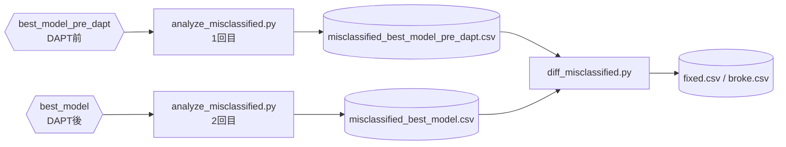
```mermaid
flowchart LR
    M1{{"best_model_pre_dapt<br/>DAPT前"}} --> A1["analyze_misclassified.py<br/>1回目"] --> C1[("misclassified_best_model_pre_dapt.csv")]
    M2{{"best_model<br/>DAPT後"}} --> A2["analyze_misclassified.py<br/>2回目"] --> C2[("misclassified_best_model.csv")]
    C1 --> DF["diff_misclassified.py"] --> FB[("fixed.csv / broke.csv")]
    C2 --> DF
```

2回とも入力データは同じ `data/test/reviews_ood_2000.csv` です（線が増えて読みにくくなるため図では省略）。
`fixed` は「DAPT後に直ったレビュー」、`broke` は「DAPT後に壊れたレビュー」です。

### 手順2: 差分を分析する

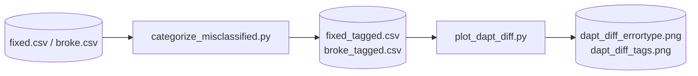
```mermaid
flowchart LR
    FB[("fixed.csv / broke.csv")] --> CAT["categorize_misclassified.py"] --> TG[("fixed_tagged.csv<br/>broke_tagged.csv")]
    TG --> PL["plot_dapt_diff.py"] --> PNG[("dapt_diff_errortype.png<br/>dapt_diff_tags.png")]
```

`plot_dapt_diff.py` はタグ付きCSVだけでなく、素の `fixed.csv` / `broke.csv` も読みます。
そのため `categorize_misclassified.py` を先に通しておく必要があります。

### 手順3: なぜ間違えたかを調べる（手順2とは独立）

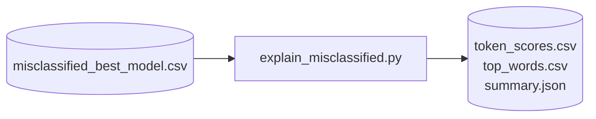
```mermaid
flowchart LR
    C2b[("misclassified_best_model.csv")] --> EX["explain_misclassified.py"] --> TK[("token_scores.csv<br/>top_words.csv<br/>summary.json")]
```

---

## evaluation/ — モデル評価・比較・検証

| ファイル | 説明 |
|---|---|
| `compare_models_ood.py` | 複数モデルのOOD性能比較（accuracy/P/R/F1・McNemar） |
| `seed_study.py` | 多シードでDAPT効果を検証（Issue#24・平均±SD＋ペア検定・代表モデル選定） |
| `validate_sentiment_english.py` | 英語100件での感情分析精度検証 |

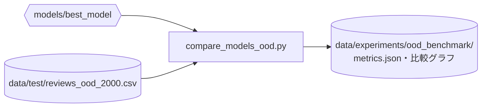
```mermaid
flowchart LR
    M2{{"models/best_model"}} --> E1["compare_models_ood.py"] --> O1[("data/experiments/ood_benchmark/<br/>metrics.json・比較グラフ")]
    D2[("data/test/reviews_ood_2000.csv")] --> E1
```

`seed_study.py` と `learning_curve_experiment.py` だけは、CSVを介さず
`train_sentiment.py` の関数を**直接呼んで**何度も学習を回します。

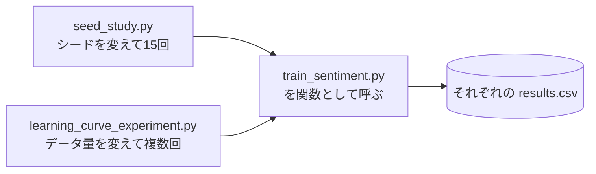
```mermaid
flowchart LR
    S["seed_study.py<br/>シードを変えて15回"] --> TS["train_sentiment.py<br/>を関数として呼ぶ"]
    L["learning_curve_experiment.py<br/>データ量を変えて複数回"] --> TS
    TS --> R[("それぞれの results.csv")]
```

**使用方法:**
```bash
make compare-ood            # OOD性能比較
make seed-study             # 多シード検証（GPU長時間。SEEDS=15で数変更）
make seed-study-analyze     # 多シード検証の集計のみ
```

---

## learning_curve/ — データ量と精度の関係

| ファイル | 説明 |
|---|---|
| `learning_curve_experiment.py` | データ量と精度の関係を複数seedで検証 |
| `analyze_learning_curve.py` | Learning Curve実験結果の分析・可視化 |

**使用方法:**
```bash
make learning-curve                        # 10k vs 20k で比較（デフォルト）
make learning-curve SIZES="5000 10000"     # サイズを指定して比較
make analyze-curve                         # 実験結果の分析・可視化
```

---

## topic/ — トピック抽出実験

| ファイル | 説明 |
|---|---|
| `bertopic_experiment.py` | BERTopicパラメータ実験 |

---

## benchmarks/ — 性能・実行可能性の計測

GPU性能・ファインチューニング負荷・DAPTの実行可能性などを「測る」スクリプト。

| ファイル | 説明 |
|---|---|
| `gpu_benchmark.py` | GPU性能計測 |
| `benchmark_finetuning.py` | ファインチューニングのGPU負荷検証 |
| `dapt_feasibility.py` | DAPT着手前の実行可能性（メモリ・所要時間）計測 |
| `timeseries_feasibility.py` | 時系列予測着手前の実行可能性計測。レビュー発生密度・英語フィルタ通過率・自然ポジ率を実測し、集計粒度（日次/週次）と必要ゲーム数を試算（Issue #31） |
| `seasonality_check.py` | レビュー投稿数の季節性測定。複数ゲームを合算し、年ごとの月別シェアの形が繰り返されるかで年次周期の有無を判定（Issue #32 の遡る期間を決めるため） |

---

## 関連

- [../src/README.md](../src/README.md) — スクリプトが使う部品（モジュール）の一覧と依存関係
- [../tests/README.md](../tests/README.md) — テストと対象モジュールの対応
- [ドキュメントマップ](https://github.com/rindguitar/game-demand-forecast/wiki/Documentation-Map) — Wiki全体の繋がり
