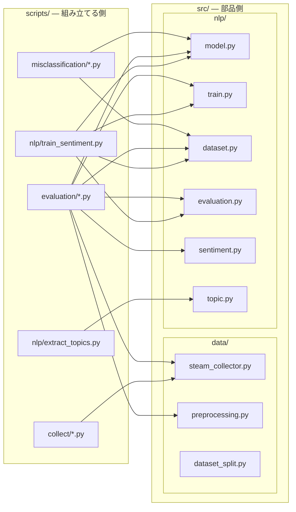

# src/

プロジェクトのコアモジュール群。各ディレクトリがパイプラインの1フェーズに対応しています。

## ディレクトリ構成

```
src/
├── data/           # データ収集・前処理
├── nlp/            # 自然言語処理（感情分析・トピック抽出）
├── timeseries/     # 時系列予測（実装予定）
├── integration/    # NLP + 時系列の統合（実装予定）
├── utils/          # ユーティリティ（実装予定）
└── visualization/  # 可視化
```

---

## モジュールの繋がり

**`src/` の中では、モジュール同士がひとつもimportし合っていません。**
`src/` は独立した部品を並べた「部品箱」で、それを組み立てて処理にするのは `scripts/` 側の役割です。



この構造の意味は次の通りです。

- **利点**: 部品を単体でテストしやすく、差し替えやすい。`src/nlp/model.py` を読むのに他のファイルを追う必要がない
- **代償**: 処理の全体像は `src/` を読んでも分からない。「どういう順で呼ばれるか」は [../scripts/README.md](../scripts/README.md) の流れ図を見る必要がある

### どこからも呼ばれていないモジュール

図に線が繋がっていない、現状スクリプトから使われていないファイルです。

| ファイル | 状態 |
|---|---|
| `data/dataset_split.py` | どのスクリプトからも呼ばれていない。`train_sentiment.py` は自前で `train_test_split` を呼んでいる |
| `visualization/sentiment_plots.py` | どこからも呼ばれておらず、さらに冒頭で **存在しない `src/nlp/sentiment_db.py` をimportしている**ため、現状そのままでは実行できない |


---

## data/ — データ収集・前処理

| ファイル | 説明 |
|---|---|
| `steam_collector.py` | Steam APIからレビューを収集。langdetectによる英語フィルタリング付き |
| `preprocessing.py` | レビューテキストのクリーニング・前処理 |
| `dataset_split.py` | Train/Val/Testへの分割ユーティリティ（stratify対応） |

**主要関数:**
- `get_steam_reviews(app_id, language, review_type, num)` — レビュー収集
- `collect_balanced_reviews(app_id, n_positive, n_negative)` — balanced収集
- `is_valid_english_review(text)` — 英語判定（ASCII・langdetect）

---

## nlp/ — 自然言語処理

### 感情分析（DistilBERT）

| ファイル | 説明 |
|---|---|
| `model.py` | DistilBERTベースの感情分析モデル定義（dropout=0.3） |
| `train.py` | 学習ループ（Early Stopping・lr=1e-5・patience=3） |
| `dataset.py` | PyTorch Dataset / DataLoader の作成 |
| `evaluation.py` | Accuracy / Precision / Recall / F1評価 |
| `sentiment.py` | 事前学習済みモデルによる推論インターフェース |

### トピック抽出（BERTopic）

| ファイル | 説明 |
|---|---|
| `topic.py` | BERTopicによるトピック抽出。ゲーム名除去・英語フィルタリング付き |

**主要関数（topic.py）:**
- `create_topic_model(min_topic_size, embedding_model_name)` — モデル作成
- `extract_topics(texts, topic_model)` — トピック抽出実行
- `remove_game_names(df)` — 自己言及問題を防ぐゲーム名除去

---

## timeseries/ — 時系列予測（実装予定）

NLP結果とプレイヤー数を組み合わせた需要予測フェーズ。

---

## integration/ — 統合（実装予定）

NLPスコアと時系列予測を統合して需要スコアを算出するフェーズ。

---

## visualization/ — 可視化

| ファイル | 説明 |
|---|---|
| `sentiment_plots.py` | 感情分析結果のグラフ生成 |

---

## 関連

- [../scripts/README.md](../scripts/README.md) — これらの部品を組み立てる実行スクリプトと、データの流れ
- [../tests/README.md](../tests/README.md) — テストと対象モジュールの対応
- [ドキュメントマップ](https://github.com/rindguitar/game-demand-forecast/wiki/Documentation-Map) — Wiki全体の繋がり
