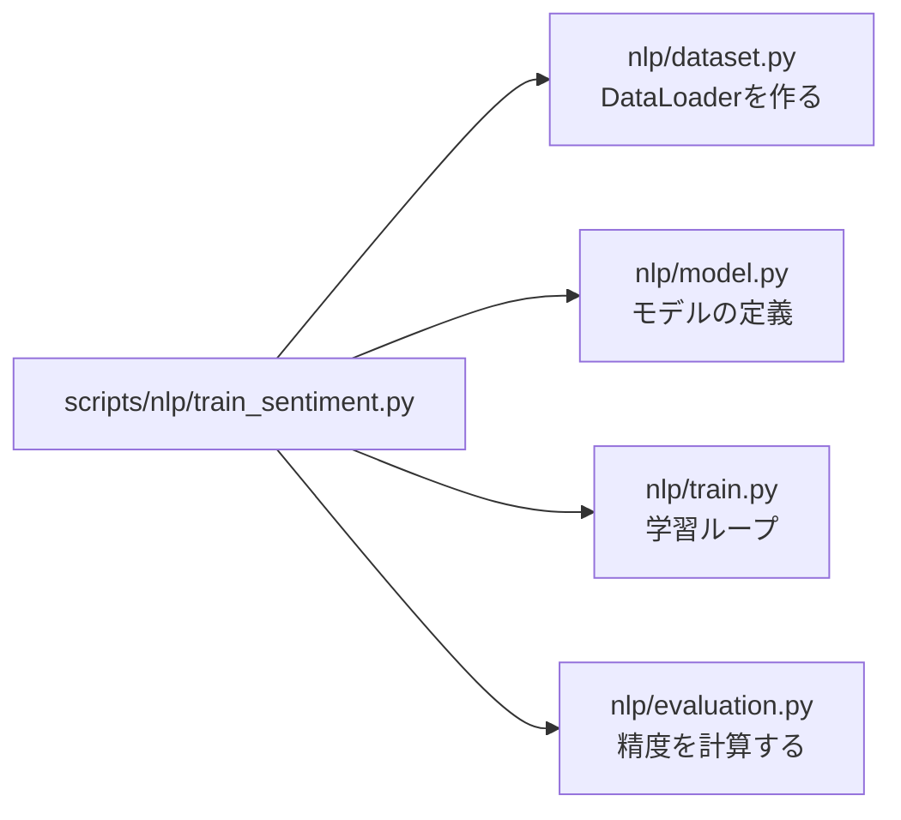
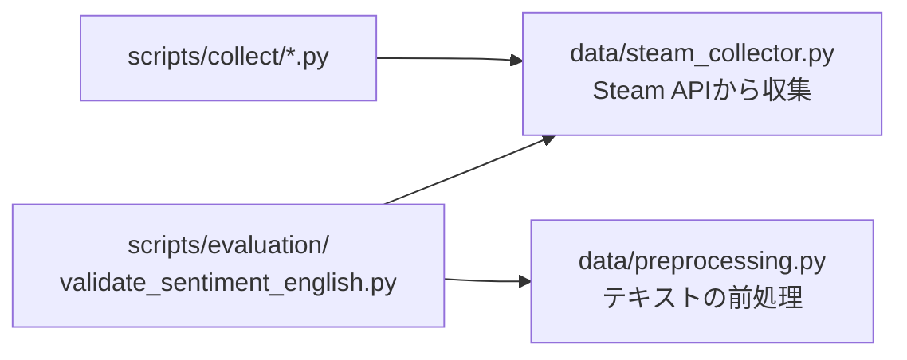
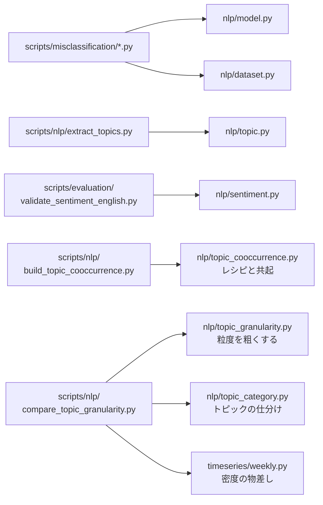

# src/

プロジェクトのコアモジュール群。各ディレクトリがパイプラインの1フェーズに対応しています。

## ディレクトリ構成

```
src/
├── data/           # データ収集・前処理
├── nlp/            # 自然言語処理（感情分析・トピック抽出）
├── timeseries/     # 週次時系列の作成・時系列予測
├── integration/    # NLP + 時系列の統合（実装予定）
├── utils/          # ユーティリティ（実装予定）
└── visualization/  # 可視化
```

---

## モジュールの繋がり

**`src/` の中では、モジュール同士がひとつもimportし合っていません。**
`src/` は独立した部品を並べた「部品箱」で、それを組み立てて処理にするのは `scripts/` 側の役割です。

そのため図は「どのスクリプトが、どの部品を使うか」だけになります。用途ごとに分けて描きます。

**感情分析モデルを学習するときに使う部品**



**データを集めるときに使う部品**



**学習済みモデルを使って調べるときの部品**



図に描いていない線が1本あります。`build_topic_cooccurrence.py` は
`nlp/topic_cooccurrence.py` のほかに、**`nlp/topic_granularity.py`**（レベル300で単位を作る）と
**`nlp/topic_category.py`**（中身なし・固有名詞をレシピから外す）も使います。
線を描くと交差するので本文に出しました。

この構造の意味は次の通りです。

- **利点**: 部品を単体でテストしやすく、差し替えやすい。`src/nlp/model.py` を読むのに他のファイルを追う必要がない
- **代償**: 処理の全体像は `src/` を読んでも分からない。「どういう順で呼ばれるか」は [../scripts/README.md](../scripts/README.md) の図を見る必要がある

### どこからも呼ばれていないモジュール

上の図に出てこない、現状スクリプトから使われていないファイルです。

| ファイル | 状態 |
|---|---|
| `data/dataset_split.py` | どのスクリプトからも呼ばれていない。`train_sentiment.py` は自前で `train_test_split` を呼んでいる |
| `visualization/sentiment_plots.py` | どこからも呼ばれておらず、さらに冒頭で **存在しない `src/nlp/sentiment_db.py` をimportしている**ため、現状そのままでは実行できない |

---

## data/ — データ収集・前処理

| ファイル | 説明 |
|---|---|
| `steam_collector.py` | Steam APIからレビューを収集。langdetectによる英語フィルタリング付き |
| `preprocessing.py` | レビューテキストのクリーニング・前処理 |
| `dataset_split.py` | Train/Val/Testへの分割ユーティリティ（stratify対応） |

**主要関数:**
- `get_steam_reviews(app_id, language, review_type, num)` — レビュー収集
- `collect_balanced_reviews(app_id, n_positive, n_negative)` — balanced収集
- `is_valid_english_review(text)` — 英語判定（ASCII・langdetect）

---

## nlp/ — 自然言語処理

### 感情分析（DistilBERT）

| ファイル | 説明 |
|---|---|
| `model.py` | DistilBERTベースの感情分析モデル定義（dropout=0.3） |
| `train.py` | 学習ループ（Early Stopping・lr=1e-5・patience=3） |
| `dataset.py` | PyTorch Dataset / DataLoader の作成 |
| `evaluation.py` | Accuracy / Precision / Recall / F1評価 |
| `sentiment.py` | 事前学習済みモデルによる推論インターフェース |

### トピック抽出（BERTopic）

| ファイル | 説明 |
|---|---|
| `topic.py` | BERTopicによるトピック抽出。ゲーム名除去・英語フィルタリング付き |
| `topic_category.py` | 抽出したトピックの仕分け（①要素 / ②品質・運営 / ③ビジネス条件 / 中身なし / 固有名詞） |
| `topic_bundle.py` | 小さいトピックをSteamタグの語彙に束ねる |
| `topic_granularity.py` | 抽出済みのトピックをマージ木にまとめ、任意の個数で切って粗い版を作る |
| `topic_cooccurrence.py` | ゲームごとのレシピ（そのゲームらしい部品）と、部品ペアの共起を出す |

**主要関数（topic.py）:**
- `create_topic_model(min_topic_size, embedding_model_name)` — モデル作成
- `extract_topics(texts, topic_model)` — トピック抽出実行
- `remove_game_names(df, all_games, extra_words)` — ゲーム名・固有名詞の除去。
  範囲は「語 × ゲーム」で決める（2語以上のタイトルの並びと `configs/proper_nouns.txt` は
  全レビュー、タイトルを割った単語は自ゲームのレビューのみ）。→ `docs/decisions.md` 2026-09-06

**主要関数（topic_category.py）:**
- `load_category_words(path)` — 分類語彙を読む（`configs/topic_categories.txt`）
- `classify_topic(keywords, words)` — トピック1件を仕分ける。どの語彙にも当たらなければ
  ①ゲーム要素、複数の分類が同数で当たったら `ambiguous`（手動送り）。
  固有名詞は同数でも優先する（束ねる対象から確実に外すため）

**主要関数（topic_bundle.py）:**
- `load_tag_vocabulary(genres, tags)` — 台帳のジャンル列・タグ列から束ね先を作る（長い順）
- `assign_bundle(keywords, vocabulary)` — 束ね先タグを1つ決める。当たらなければ `None`

**主要関数（topic_granularity.py）:**
- `topic_matrix(model, source)` — モデルからトピックの行列を取る。`ctfidf` は語の重なり、
  `embedding` は意味の近さ。Outlier（-1）は束ねる対象ではないので外す
- `build_linkage(matrix)` — コサイン距離でマージ木を作る（BERTopic の `hierarchical_topics`
  と同じ ward 法。本家と違い fit 時の文書が要らないので保存済みモデルだけで動く）
- `cut_levels(tree, topic_ids, levels)` — 木を指定の個数で切る。同じ木を切るので粗いレベルは
  細かいレベルの入れ子になり、「粒度だけを動かした」比較が成立する
- `group_dispersion(model, mapping)` — 束の中のトピック同士がどれだけ離れているか。
  束ね方によらず埋め込み空間で測るので、語の重なりで束ねた結果の審判にも使える

**主要関数（topic_cooccurrence.py）:**
- `compute_lift(matrix)` — そのゲームらしさ = そのゲームでの出現率 ÷ 全体での出現率。
  **出現では測らない**（時系列に乗る35単位のうち21個が全24本に出るのでほぼ全結合になる）
- `extract_recipes(matrix, lift, min_lift, min_count)` — ゲームごとのレシピ。
  件数の下限も置く（リフトは分母が小さいと跳ねるため）
- `build_cooccurrence(recipes)` — 同じレシピに入った部品ペアを、ゲーム数で数える

---

## timeseries/ — 週次時系列の作成・時系列予測

NLP結果とプレイヤー数を組み合わせた需要予測フェーズ。予測モデル（Prophet等）は実装予定。

| ファイル | 説明 |
|---|---|
| `weekly.py` | トピックの週次時系列を作る（件数・シェア・ポジ率・期待ポジ率・参加ゲーム数） |

充足度は**実際のポジ率とあわせて「期待ポジ率」も出します**。`voted_up` はゲーム全体への評価なので、
トピックの絶対値だとそのゲームの評判を読んでしまうためです（→ `docs/decisions.md` 2026-09-07）。
差の `positive_rate_gap` が要素そのものの効き方になります。

**可視化は `src/visualization/timeseries_plots.py`**（`plot_series_grid` / `plot_positive_rate_grid` / `plot_overview`）。充足度の配色はオレンジ ↔ アクア。

**主要関数（weekly.py）:**
- `add_week_column(df)` — UNIX秒からその週の月曜を指す列を足す
- `trim_partial_weeks(df)` — 端の部分週を落とす（7日そろっていない週は件数が落ちて誤読される）
- `build_weekly_series(df, ...)` — 単位 × 週の表を作る。週の軸は連続した週で埋め、
  各単位の初出より前は欠測にする（需要ゼロではなく観測対象外のため）
- `weekly_median(df, week_axis, unit_column)` — 単位ごとの週あたり件数の中央値。
  平均だと発売スパイク型が密度十分に見える（→ `docs/decisions.md` 2026-09-07）
- `measure_topic_panels(df, backbone_games, unit_column)` — パネルごとの密度とゲーム集中度。
  `scripts/nlp/categorize_topics.py` と `scripts/nlp/compare_topic_granularity.py` の
  **両方がこれを呼ぶ**。粒度を変えて比べるとき、物差しが1つでないと比較が成り立たないため

---

## integration/ — 統合（実装予定）

NLPスコアと時系列予測を統合して需要スコアを算出するフェーズ。

---

## visualization/ — 可視化

| ファイル | 説明 |
|---|---|
| `sentiment_plots.py` | 感情分析結果のグラフ生成 |

---

## 関連

- [../scripts/README.md](../scripts/README.md) — これらの部品を組み立てる実行スクリプトと、データの流れ
- [../tests/README.md](../tests/README.md) — テストと対象モジュールの対応
- [ドキュメントマップ](https://github.com/rindguitar/game-demand-forecast/wiki/Documentation-Map) — Wiki全体の繋がり
