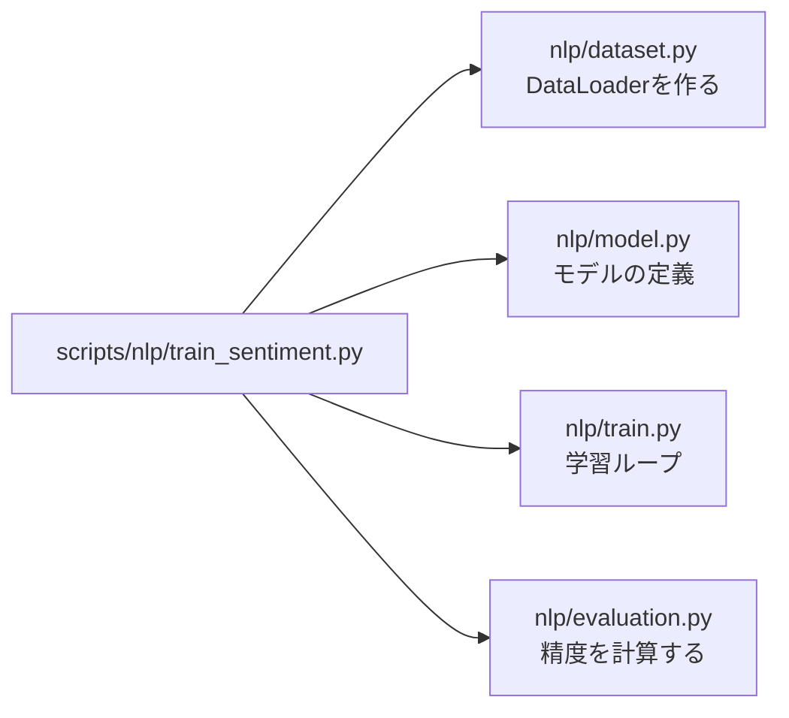
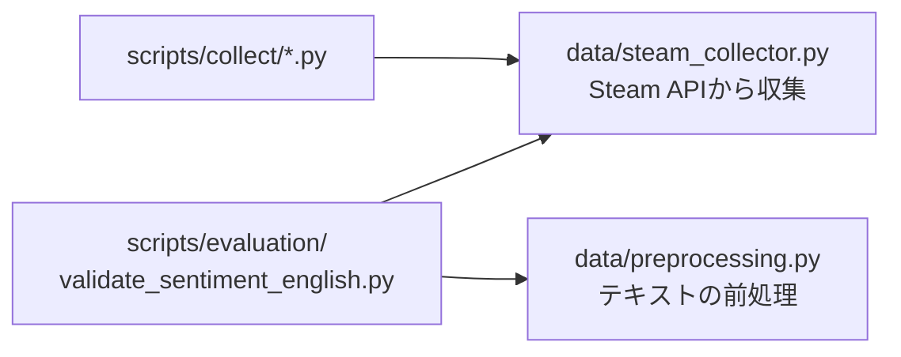
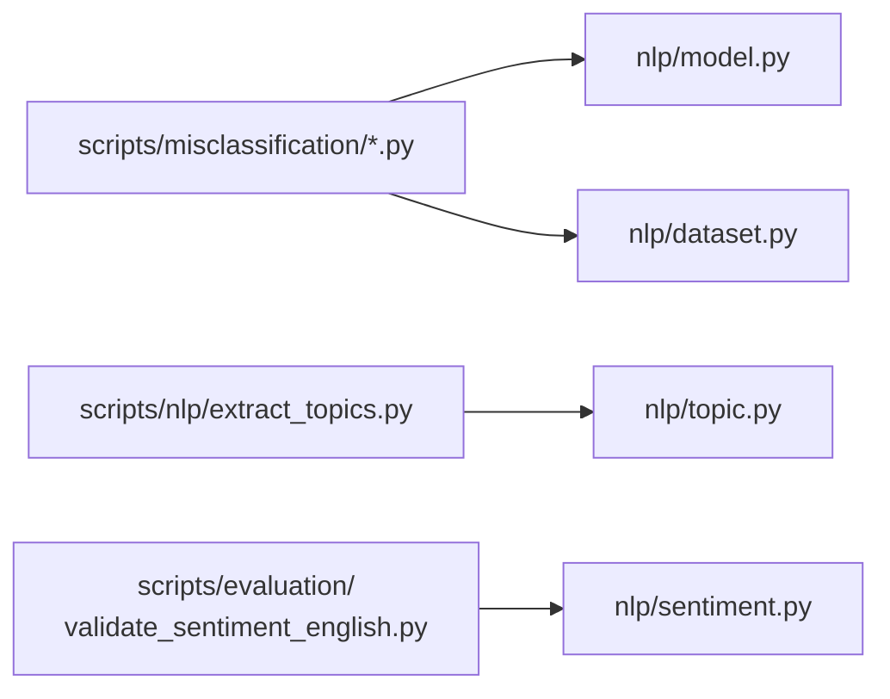
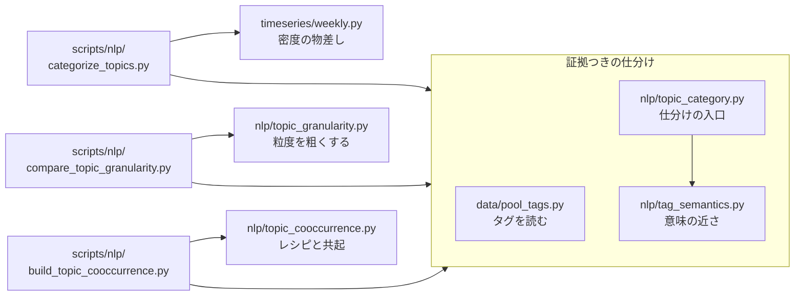
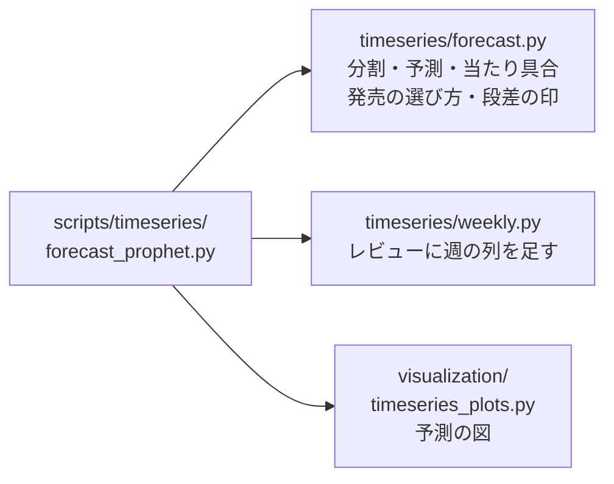

# src/

プロジェクトのコアモジュール群。各ディレクトリがパイプラインの1フェーズに対応しています。

## ディレクトリ構成

```
src/
├── data/           # データ収集・前処理
├── nlp/            # 自然言語処理（感情分析・トピック抽出）
├── timeseries/     # 週次時系列の作成・時系列予測
├── integration/    # NLP + 時系列の統合（実装予定）
├── utils/          # ユーティリティ（実装予定）
└── visualization/  # 可視化
```

---

## モジュールの繋がり

**`src/` の中では、モジュール同士は基本的にimportし合いません。**
`src/` は独立した部品を並べた「部品箱」で、それを組み立てて処理にするのは `scripts/` 側の役割です。
例外は `nlp/topic_category.py → nlp/tag_semantics.py` の1本だけです（動かない `sentiment_plots.py` を除く）。
仕分けの入口が①の証拠を必ず測るように、あえて繋いでいます（`docs/decisions.md` 2026-09-27）。

そのため図は「どのスクリプトが、どの部品を使うか」だけになります。用途ごとに分けて描きます。

**感情分析モデルを学習するときに使う部品**


```mermaid
flowchart LR
    TS["scripts/nlp/train_sentiment.py"] --> DS["nlp/dataset.py<br/>DataLoaderを作る"]
    TS --> MD["nlp/model.py<br/>モデルの定義"]
    TS --> TR["nlp/train.py<br/>学習ループ"]
    TS --> EV["nlp/evaluation.py<br/>精度を計算する"]
```

**データを集めるときに使う部品**


```mermaid
flowchart LR
    CO["scripts/collect/*.py"] --> SC["data/steam_collector.py<br/>Steam APIから収集"]
    VA["scripts/evaluation/<br/>validate_sentiment_english.py"] --> SC
    VA --> PR["data/preprocessing.py<br/>テキストの前処理"]
```

**学習済みモデルを使って調べるときの部品**


```mermaid
flowchart LR
    AN["scripts/misclassification/*.py"] --> MD2["nlp/model.py"]
    AN --> DS2["nlp/dataset.py"]
    ET["scripts/nlp/extract_topics.py"] --> TP["nlp/topic.py"]
    VA2["scripts/evaluation/<br/>validate_sentiment_english.py"] --> SN["nlp/sentiment.py"]
```

**抽出したトピックを仕分けて測るときの部品**


```mermaid
flowchart LR
    CT["scripts/nlp/<br/>categorize_topics.py"] --> WK["timeseries/weekly.py<br/>密度の物差し"]
    CG["scripts/nlp/<br/>compare_topic_granularity.py"] --> TG["nlp/topic_granularity.py<br/>粒度を粗くする"]
    CO["scripts/nlp/<br/>build_topic_cooccurrence.py"] --> TQ["nlp/topic_cooccurrence.py<br/>レシピと共起"]
    CT --> CLS
    CG --> CLS
    CO --> CLS
    %% 見えない線（~~~）は、箱を右端の列に置いて交差を消すためのもの
    WK ~~~ CLS
    TQ ~~~ CLS
    TG ~~~ CLS
    subgraph CLS["証拠つきの仕分け"]
        direction TB
        PT["data/pool_tags.py<br/>タグを読む"]
        TC["nlp/topic_category.py<br/>仕分けの入口"] --> TS["nlp/tag_semantics.py<br/>意味の近さ"]
    end
```

3本のスクリプトは、箱の中の3つを同じ順で使います（`pool_tags` でタグを読む →
`tag_semantics.element_tags` で①の語彙にする → `topic_category.classify_with_evidence` で仕分ける）。
仕分けの入口が1つなので、①の証拠（タグとの意味の近さ）を付け忘れることがありません。

ただし `build_topic_cooccurrence.py` は、**束ねないとき**（全単位がトピック1個）はこの箱を通らず、
`categorize_topics.py` が出した分類CSVをそのまま単位に当てます（`topic_cooccurrence.unit_categories_from_topics`）。
箱を通るのは束ねたときだけです。

図に描いていない線が2本あります。`compare_topic_granularity.py` は **`timeseries/weekly.py`** も、
`build_topic_cooccurrence.py` は **`nlp/topic_granularity.py`**（レベル300で単位を作る）も使います。
線を描くと交差するので本文に出しました。

**週次のシェアを予測するときに使う部品**


```mermaid
flowchart LR
    FP["scripts/timeseries/<br/>forecast_prophet.py"] --> FC["timeseries/forecast.py<br/>分割・予測・当たり具合<br/>発売の選び方・段差の印"]
    FP --> WK["timeseries/weekly.py<br/>レビューに週の列を足す"]
    FP --> TP["visualization/<br/>timeseries_plots.py<br/>予測の図"]
```

`forecast.py` はファイルを読み書きしない純粋な関数だけで、読み書きと図は `forecast_prophet.py` が受け持ちます。
`weekly.py` は、`--launch-events` のとき発売を選ぶために、レビューへ週の列を足すのに使います（`add_week_column`）。

この構造の意味は次の通りです。

- **利点**: 部品を単体でテストしやすく、差し替えやすい。`src/nlp/model.py` を読むのに他のファイルを追う必要がない
- **代償**: 処理の全体像は `src/` を読んでも分からない。「どういう順で呼ばれるか」は [../scripts/README.md](../scripts/README.md) の図を見る必要がある

### どこからも呼ばれていないモジュール

上の図に出てこない、現状スクリプトから使われていないファイルです。

| ファイル | 状態 |
|---|---|
| `data/dataset_split.py` | どのスクリプトからも呼ばれていない。`train_sentiment.py` は自前で `train_test_split` を呼んでいる |
| `visualization/sentiment_plots.py` | どこからも呼ばれておらず、さらに冒頭で **存在しない `src/nlp/sentiment_db.py` をimportしている**ため、現状そのままでは実行できない |

---

## data/ — データ収集・前処理

| ファイル | 説明 |
|---|---|
| `steam_collector.py` | Steam APIからレビューを収集。langdetectによる英語フィルタリング付き |
| `preprocessing.py` | レビューテキストのクリーニング・前処理 |
| `dataset_split.py` | Train/Val/Testへの分割ユーティリティ（stratify対応） |
| `pool_tags.py` | 母集団キャッシュ（`pool_cache.json`）からSteamのユーザータグを読む |
| `collection_progress.py` | レビュー収集の途中経過（どのcursorまで取ったか）の保存と再開 |

**主要関数:**
- `get_steam_reviews(app_id, language, review_type, num)` — レビュー収集
- `collect_balanced_reviews(app_id, n_positive, n_negative)` — balanced収集
- `is_valid_english_review(text)` — 英語判定（ASCII・langdetect）
- `load_pool_tags(path, min_tags, only_games)` — ゲーム × タグの縦長を作る。
  タグは**供給の信号**（市場が何を出荷したか）で、レビューを集めていないゲームについても取れる
- `iter_natural_reviews(app_id, since_ts, ..., start_cursor, collected)` —
  `collect_natural_reviews` のページ単位版。`start_cursor` に前回の続きを渡せば途中から再開できる
- `advance(entry, page, cursor)`（`collection_progress.py`）— 件数・最古・最新・ポジ数を
  流しながら集計する。カバー率の判定にはこれだけあれば足り、全レビューをメモリに残さずに済む

---

## nlp/ — 自然言語処理

### 感情分析（DistilBERT）

| ファイル | 説明 |
|---|---|
| `model.py` | DistilBERTベースの感情分析モデル定義（dropout=0.3） |
| `train.py` | 学習ループ（Early Stopping・lr=1e-5・patience=3） |
| `dataset.py` | PyTorch Dataset / DataLoader の作成 |
| `evaluation.py` | Accuracy / Precision / Recall / F1評価 |
| `sentiment.py` | 事前学習済みモデルによる推論インターフェース |

### トピック抽出（BERTopic）

| ファイル | 説明 |
|---|---|
| `topic.py` | BERTopicによるトピック抽出。ゲーム名除去・英語フィルタリング付き |
| `topic_category.py` | 抽出したトピックの仕分け（①要素 / ②品質・運営 / ③ビジネス条件 / 中身なし / 固有名詞 / 未分類） |
| `topic_bundle.py` | 小さいトピックをSteamタグの語彙に束ねる |
| `topic_granularity.py` | 抽出済みのトピックをマージ木にまとめ、任意の個数で切って粗い版を作る |
| `tag_semantics.py` | トピックとSteamタグを「意味の近さ」で照合する（①の証拠を作る）。①にするタグの判定は `configs/steam_tags.txt` |
| `topic_cooccurrence.py` | ゲームごとのレシピ（そのゲームらしい部品）と、部品ペアの共起を出す。束ねないときの単位の分類も、公式の分類から引く |

**主要関数（topic.py）:**
- `create_topic_model(min_topic_size, embedding_model_name)` — モデル作成
- `extract_topics(texts, topic_model)` — トピック抽出実行
- `remove_game_names(df, all_games, extra_words)` — ゲーム名・固有名詞の除去。
  範囲は「語 × ゲーム」で決める（2語以上のタイトルの並びと `configs/proper_nouns.txt` は
  全レビュー、タイトルを割った単語は自ゲームのレビューのみ）。→ `docs/decisions.md` 2026-09-06

**主要関数（topic_category.py）:**
- `load_category_words(path)` — 分類語彙を読む（`configs/topic_categories.txt`）
- `classify_topic(keywords, words, element_score)` — トピック1件を仕分ける。どの語彙にも
  当たらず `element_score` も弱ければ **未分類**、複数の分類が同数で当たったら `ambiguous`
  （手動送り）。固有名詞は同数でも優先する（束ねる対象から確実に外すため）。
  `element_score` は**省略不可**（既定値を持たせると、証拠を測らずに呼んでも黙って通る）
  - `element_score` はタグとの近さ（0〜1）。**強い証拠（0.65以上）は多数決の外で確定**させる。
    意味の近さと語の数は単位が違うので、1票として混ぜると `sandbox`（0.78）が
    `game best`（1票）と並んでしまう
  - **①ゲーム要素は証拠のある分類**。かつては残余（どこにも当たらなければ①）だったため、
    語彙の穴がそのまま需要スコアに混入していた（実測: 64本で `boobs` `braindead` `money`
    `ruined life` が①に入った）。→ `docs/decisions.md` 2026-09-21
- `classify_topics(topics, words, element_scores)` — 一覧をまとめて仕分ける。`element_scores`
  に無い `topic_id` があれば `KeyError`（黙って0点にしない）
- `classify_with_evidence(topics, words, element_vocabulary, encoder=None)` — **スクリプトが使う唯一の入口**。
  `tag_semantics.match_terms` で①の語彙（Steamタグ）との近さを測ってから `classify_topics` に渡す。
  `element_vocabulary` が空だと `ValueError`。戻り値は `ClassifiedTopic`
  （topic_id, keywords, category, hits, tag, tag_score）のNamedTuple
- `MEANINGFUL_CATEGORIES = (ELEMENT, QUALITY, BUSINESS)` — 中身のある3分類の共通定義。
  束ねる・時系列に乗せる対象を選ぶ側（`build_weekly_series.py` 等）はここを import する

**主要関数（tag_semantics.py）:**
- `element_tags(pool, judgments=None)` — 母集団のタグから①ゲーム要素の語彙を集める。
  判定は `configs/steam_tags.txt`（`load_tag_judgments`）から読み、判定の無いタグがあれば
  `ValueError`（新しいタグを黙って①に入れないため）。除くのは
  「ゲームの中身を表さないタグ」（`not_content`）と「遊んだ結果の感想」（`impression`）
- `load_tag_judgments(path)` — 判定ファイルを読む（`[not_content]` `[impression]` `[element]`
  の見出しで区切り・1行1タグ）。ファイルが無ければ `FileNotFoundError`、
  同じタグが2つの見出しにあれば `ValueError`（移し替えで元の行を消し忘れても①に残らないように）
- `match_terms(texts, vocabulary, encoder=None)` — テキストごとに、いちばん意味の近い語と
  その近さ（コサイン類似度）を返す。`Souls-like` ↔ `soulslike` のような表記ゆれを拾うために使う

**主要関数（topic_bundle.py）:**
- `load_tag_vocabulary(genres, tags)` — 台帳のジャンル列・タグ列から束ね先を作る（長い順）
- `assign_bundle(keywords, vocabulary)` — 束ね先タグを1つ決める。当たらなければ `None`

**主要関数（topic_granularity.py）:**
- `topic_matrix(model, source)` — モデルからトピックの行列を取る。`ctfidf` は語の重なり、
  `embedding` は意味の近さ。Outlier（-1）は束ねる対象ではないので外す
- `build_linkage(matrix)` — コサイン距離でマージ木を作る（BERTopic の `hierarchical_topics`
  と同じ ward 法。本家と違い fit 時の文書が要らないので保存済みモデルだけで動く）
- `cut_levels(tree, topic_ids, levels)` — 木を指定の個数で切る。同じ木を切るので粗いレベルは
  細かいレベルの入れ子になり、「粒度だけを動かした」比較が成立する
- `group_dispersion(model, mapping)` — 束の中のトピック同士がどれだけ離れているか。
  束ね方によらず埋め込み空間で測るので、語の重なりで束ねた結果の審判にも使える

**主要関数（topic_cooccurrence.py）:**
- `has_bundled_units(mapping)` — 束ねた単位（2トピック以上）が1つでもあるか。単位の数がトピックの数より
  少なければ束ねている。スクリプトが「公式の分類を使うか、その場で仕分けるか」を分ける判定に使う
- `unit_categories_from_topics(mapping, topic_categories)` — **束ねないとき**の「単位 → 分類」を、
  トピックごとの公式の分類（`categorize_topics.py` の出力）から引く。束ねた単位があれば `ValueError`
  （トピック単位の分類は束に当てられない）、分類に無いトピックがあっても `ValueError`（既定値で埋めない）。
  単位の番号とトピックIDはずれる（64本・526単位では全単位が +1）ので、対応は必ず `mapping` で取る
- `compute_lift(matrix)` — そのゲームらしさ = そのゲームでの出現率 ÷ 全体での出現率。
  **出現では測らない**（ほぼ全結合になる。24本・300単位での実測: 時系列に乗る35単位のうち21個が全24本に出た）
- `extract_recipes(matrix, lift, min_lift, min_count)` — ゲームごとのレシピ。
  件数の下限も置く（リフトは分母が小さいと跳ねるため）
- `build_cooccurrence(recipes)` — 同じレシピに入った部品ペアを、ゲーム数で数える
- `game_similarity(memberships)` — ゲーム同士の似方（Jaccard）。タグとトピックは語彙が違って
  ペアを直接比べられないので、ゲームの似方に落として突き合わせる

---

## timeseries/ — 週次時系列の作成・時系列予測

NLP結果とプレイヤー数を組み合わせた需要予測フェーズ。Prophet のベースライン（`forecast.py`）まで実装済みで、ほかの予測モデルは実装予定。

| ファイル | 説明 |
|---|---|
| `weekly.py` | トピックの週次時系列を作る（件数・シェア・ポジ率・期待ポジ率・参加ゲーム数）。共通の期間と土台のゲームの決め方（3本のスクリプトの入口）もここに置く |
| `forecast.py` | 週次シェアを Prophet で予測し、比べる相手（学習期間の平均・直近の平均）と当たり具合（MAE）を比べる。発売を出来事（holidays）や水準の段差の印として渡すための、発売の選び方・印の付け方・発売の効き目の読み取り・勝ちの基準の判定もここにある。ファイルの読み書きはしない純粋な関数だけ（Issue #41・#60） |

充足度は**実際のポジ率とあわせて「期待ポジ率」も出します**。`voted_up` はゲーム全体への評価なので、
トピックの絶対値だとそのゲームの評判を読んでしまうためです（→ `docs/decisions.md` 2026-09-07）。
差の `positive_rate_gap` が要素そのものの効き方になります。

**可視化は `src/visualization/timeseries_plots.py`**（`plot_series_grid` / `plot_positive_rate_grid` / `plot_overview` / `plot_forecast_grid`）。充足度の配色はオレンジ ↔ アクア。
予測の図（`plot_forecast_grid`）は、Prophet を青・比べる相手をオレンジにして、同じ色の2本は実線と破線で見分ける。`launches`（単位に渡した発売）を渡したときだけ、その単位の発売週に細い点線を引き、凡例に "Launch week" を足す。

**主要関数（weekly.py）:**
- `add_week_column(df)` — UNIX秒からその週の月曜を指す列を足す
- `common_window(log, names)` — 全ゲームの収集がそろう期間 `(最初の週の月曜, 最後の週の月曜)` を、
  収集ログの oldest / newest から出す。最も遅い oldest と最も早い newest を含む週は、
  途中までしか集めていないので使わない。対象がログに無い・日付が空なら止まる
  （ロスターを2回に分けて集めると収集の端が約2週ずれ、「集めていないので0件」の偽の谷ができるため）
- `trim_to_window(df, window)` — 期間に入る週のレビューだけを残す
- `select_backbone(games, window_start, ...)` — 土台に入れるゲームを選ぶ。tier が一致し、
  発売が期間開始の `MIN_WEEKS_SINCE_RELEASE` 週以上前（発売直後の減りを入れないため）。
  発売日が読めないゲームがあれば止まる。手で外したいときだけ `exclude`（既定は外さない）
- `decide_window_and_backbone(games, log, tier, min_weeks, exclude)` — **3本のスクリプトの入口**。
  台帳の tier が一致するゲームの収集ログから `common_window` で期間を出し、その開始から
  `select_backbone` で土台を選んで、`(期間, 土台, 外れたゲーム)` を返す
- `describe_window_and_backbone(window, backbone, left_out, tier, min_weeks)` — 上の結果を
  画面に出す3行の文にする（3本で同じ表示になる）
- `build_weekly_series(df, ...)` — 単位 × 週の表を作る。週の軸は連続した週で埋め、
  各単位の初出より前は欠測にする（需要ゼロではなく観測対象外のため）
- `weekly_median(df, week_axis, unit_column)` — 単位ごとの週あたり件数の中央値。
  平均だと発売スパイク型が密度十分に見える（→ `docs/decisions.md` 2026-09-07）
- `measure_topic_panels(df, backbone_games, window, unit_column)` — パネルごとの密度とゲーム集中度。
  `scripts/nlp/categorize_topics.py` と `scripts/nlp/compare_topic_granularity.py` の
  **両方がこれを呼ぶ**。粒度を変えて比べるとき、物差しが1つでないと比較が成り立たないため。
  **期間（`window`）は省略できない**。中で期間に絞ってから測り、週の軸も期間そのものになる
  （省略できると、収集の端の週が混ざる古いやり方へ黙って戻るため。`docs/decisions.md` 2026-09-27 と同じ考え方）

期間と土台は、**`build_weekly_series.py` / `categorize_topics.py` /
`compare_topic_granularity.py` の3本が `decide_window_and_backbone` 1つを呼んで決めます**
（定義が3か所に分かれないようにするため。→ `docs/decisions.md` 2026-10-01）。

**主要関数（forecast.py）:**
- `split_train_test(df, test_weeks)` — 全単位を同じ週で学習とテストに分け、`(学習, テスト, 切る週)` を返す。
  切る週は欠測の行も含めた週の軸から決める（欠測を除いてから単位ごとに数えると、単位ごとにずれるため）。
  値が欠測の行は学習・テストとも除く
- `find_target_launches(games, first_week, cutoff, launch_weeks)` — 出来事として渡す対象の発売を台帳から選ぶ。
  発売週（発売日を含む週の月曜）から `launch_weeks` 週が、データ期間の最初の週以降と重なり、かつ発売週が
  切る週より前のもの（期間の直前に出たゲームも入る）。発売日が読めなければ止まる
- `select_launch_events(reviews, games, units, first_week, cutoff, ...)` — 各単位に渡す発売を選び、
  `unit / game / release_week / game_mentions / unit_mentions / share` の表を返す。発売ごとの「確かめる期間」
  （発売週から `launch_weeks` 週。切る週より前で打ち切る）で、そのゲームが単位のレビューの `min_share` 以上を占め、
  かつ件数が `min_weekly_mentions` × 期間の週数以上の（単位, 発売）の組を選ぶ。単位の集合に無いトピックは数えない
- `launch_holidays(events, unit, launch_weeks)` — 1単位に渡す発売を Prophet の holidays にする（`holiday` = ゲーム名・
  `ds` = 発売週・`lower_window` = 0・`upper_window` = 7×(週数−1) 日）。発売が付かない単位は `None`（渡さない）
- `launch_steps(holidays, first_week)` — 1単位に渡した発売のうち、発売週が学習期間の最初の週より後のものに、
  段差の印の列名（`step_0`, `step_1` …）を振る。`step / game / release_week` の表（ゲーム名との対応）を返す。
  付ける発売が無ければ空
- `with_step_columns(frame, steps)` — `ds` 列を持つ表に、段差の印の列を足す。発売週より前は0、発売週から後は
  ずっと1（未来の週も1）。`steps` が `None` か空なら何も足さない
- `fit_prophet(train, yearly, holidays, steps)` / `predict_prophet(model, weeks, steps)` — Prophet の学習と予測。
  `yearly` で年次季節性を切り替える（ほかは既定値）。`holidays` は出来事、`steps` は `add_regressor` の説明変数として、
  渡したときだけ Prophet に渡す。学習が `FIT_TIMEOUT_SECONDS` 秒で終わらなければ、`FitFallbackWarning` を出して、
  同じ `holidays`・`steps` のまま Newton 法で学び直す（Stan の L-BFGS が稀に終わらなくなるため）
- `forecast_prophet(train, weeks, yearly, holidays, steps)` — 上の学習と予測を続けて、指定の週の値を返す
  （負の予測もクリップしない）
- `read_launch_effects(model, train, holidays, steps)` — 学習した Prophet から、発売ごとの山の印の効き目の最大値
  （`spike_peak`。8週の窓の中の holidays の成分の最大値）と、段差の印の係数（`step_size`。印が無い発売は空）を
  読む。単位はシェア
- `baseline_mean(train, horizon)` / `baseline_recent(train, horizon, recent_weeks)` — 比べる相手。
  学習期間の平均／欠測を除いた最後の `recent_weeks` 個の平均を、テスト週の数だけ並べる
- `drop_holiday_weeks(train, holidays)` — 学習期間から、出来事の期間（`ds` + `lower_window` 日〜`ds` + `upper_window` 日）
  に入る週を除く。発売を渡す単位の比べる相手に、Prophet と同じ情報を渡すため。`holidays` が `None` なら何も除かず、
  除くと実績が1つも残らなければ止まる
- `keep_weeks_after_latest_launch(train, holidays)` — 学習期間から、最新の発売の窓が終わった次の週以降だけを残す。
  段差の印を渡す単位の比べる相手に使う（予測したい期間は印が1の状態なので、発売前の週は「いまのふだんの高さ」を
  表さない）。段差の印を付けない発売も数える。`holidays` が `None` なら何も除かず、残る実績が無ければ止まる
- `mae(actual, predicted)` / `mae_ratio(mae_prophet, mae_baseline)` — MAE と、`MAE(Prophet) ÷ MAE(比べる相手)`。
  比が1未満なら Prophet の勝ち。相手の MAE が0のときは、Prophet が外していれば `inf`、どちらも0なら `nan`
- `evaluate_unit(train, test, recent_weeks, holidays)` — 1単位を4つの方法で予測し、`(MAE 4つと比 4つの dict, 予測の表)` を返す。`holidays` があれば Prophet に渡し、比べる相手はその期間の週を除いた学習期間から作る（`None` なら従来どおり）
- `evaluate_unit_with_steps(train, test, recent_weeks, holidays)` — `evaluate_unit` の段差の印版。`(指標, 予測, 発売の効き目)`
  を返す。Prophet に `holidays` と段差の印を渡し、比べる相手は `keep_weeks_after_latest_launch` の週で作り、
  学習した Prophet から `read_launch_effects` で発売の効き目を読む。発売が付かない単位は `evaluate_unit` と同じ結果
- `summarize_comparisons(metrics)` — 評価表から、4通りの比較（Prophet 2つ × 比べる相手 2つ）ごとに、
  勝った単位数・全単位数・比の中央値をまとめる。勝ちは比が1未満だけ（ちょうど1や欠測は勝ちにしない）
- `launch_effects_table(effects_by_unit, keywords)` — 単位ごとの発売の効き目に、単位とキーワードを足して、
  `launch_effects.csv` の形（`LAUNCH_EFFECT_COLUMNS`）にまとめる
- `check_win_criterion(summary, required_wins)` — 勝ちの基準（Prophet の型ごとに、比べる相手2つの**両方**に
  `required_wins`〔既定 `WIN_CRITERION_UNITS` = 40〕単位以上で勝つ。ちょうどでも届いた扱い）に届いたかを判定する

---

## integration/ — 統合（実装予定）

NLPスコアと時系列予測を統合して需要スコアを算出するフェーズ。

---

## visualization/ — 可視化

| ファイル | 説明 |
|---|---|
| `sentiment_plots.py` | 感情分析結果のグラフ生成 |

---

## 関連

- [../scripts/README.md](../scripts/README.md) — これらの部品を組み立てる実行スクリプトと、データの流れ
- [../tests/README.md](../tests/README.md) — テストと対象モジュールの対応
- [ドキュメントマップ](https://github.com/rindguitar/game-demand-forecast/wiki/Documentation-Map) — Wiki全体の繋がり
