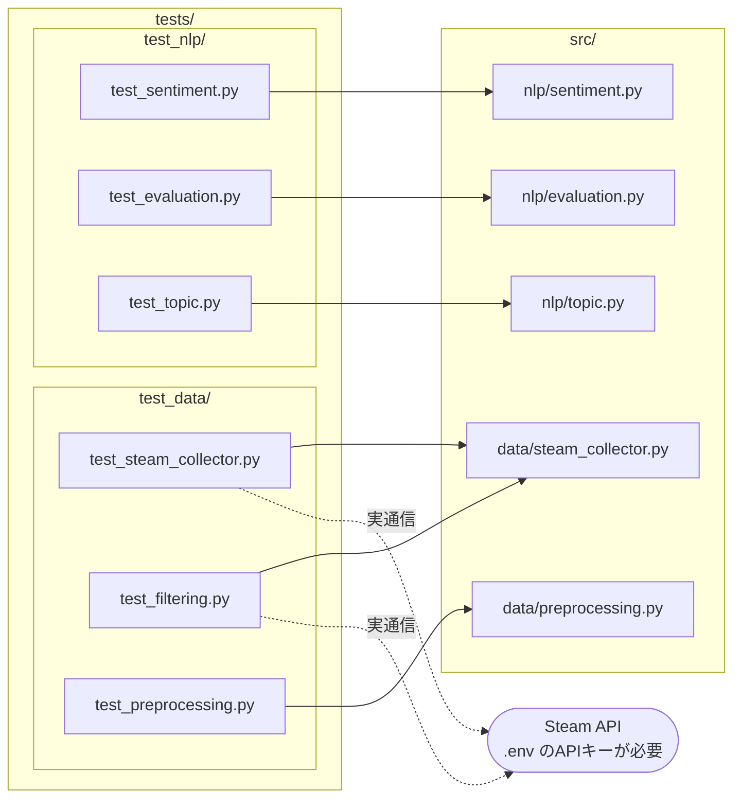

# tests/

ユニットテストと統合テスト。`src/` のモジュールに対応する形で構成されています。

## ディレクトリ構成

```
tests/
├── test_data/      # データ収集・前処理のテスト
└── test_nlp/       # NLP処理のテスト
```

---

## テストと対象モジュールの対応

テストファイルは `src/` のモジュールと1対1ではなく、`steam_collector.py` だけ2本のテストが当たっています。
また、実際にSteam APIを叩くテストが2本あります（下図の点線）。



### テストが無いモジュール

上図の `src/` 側に出てこないファイルです。学習まわりの中核（モデル定義・学習ループ）が未カバーになっています。

| モジュール | 備考 |
|---|---|
| `src/nlp/model.py` | モデル定義・保存・読み込み。多くのスクリプトが依存している |
| `src/nlp/train.py` | 学習ループ・Early Stopping |
| `src/nlp/dataset.py` | Dataset / DataLoader 作成 |
| `src/data/dataset_split.py` | そもそもどのスクリプトからも呼ばれていない |
| `src/visualization/sentiment_plots.py` | 存在しないモジュールをimportしており、現状実行できない |


---

## 実行方法

```bash
make test           # 全テスト実行
make test-nlp       # NLPテストのみ
make test-topic     # トピック抽出テストのみ
```

---

## test_data/ — データ収集・前処理テスト

| ファイル | 対象モジュール | 説明 |
|---|---|---|
| `test_steam_collector.py` | `src/data/steam_collector.py` | Steam APIレビュー収集の動作確認 |
| `test_filtering.py` | `src/data/steam_collector.py` | langdetectフィルタリングの段階別検証（フィルタリング前後の比較） |
| `test_preprocessing.py` | `src/data/preprocessing.py` | テキスト前処理の動作確認 |

> **注意**: `test_steam_collector.py` と `test_filtering.py` は実際にSteam APIを呼び出すため、実行には `.env` のAPIキー設定が必要です。

---

## test_nlp/ — NLPテスト

| ファイル | 対象モジュール | 説明 |
|---|---|---|
| `test_sentiment.py` | `src/nlp/sentiment.py` | 感情分析推論の動作確認 |
| `test_evaluation.py` | `src/nlp/evaluation.py` | 評価指標（Accuracy/F1等）の計算確認 |
| `test_topic.py` | `src/nlp/topic.py` | トピック抽出・英語フィルタリングの動作確認 |

---

## 関連

- [../src/README.md](../src/README.md) — テスト対象になっているモジュールの一覧と依存関係
- [../scripts/README.md](../scripts/README.md) — 実行スクリプトとデータの流れ
- [ドキュメントマップ](https://github.com/rindguitar/game-demand-forecast/wiki/Documentation-Map) — Wiki全体の繋がり
