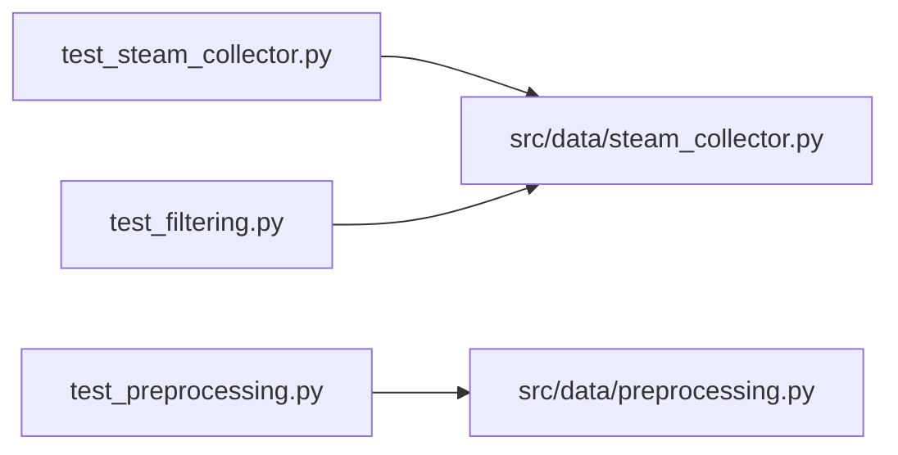
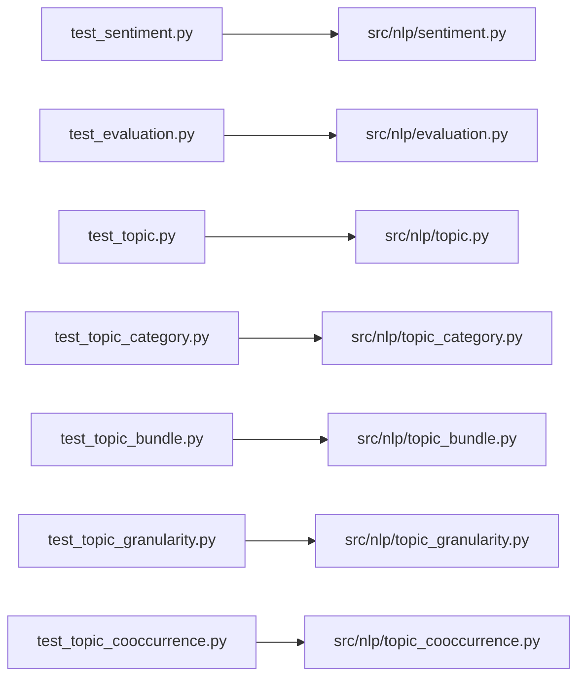
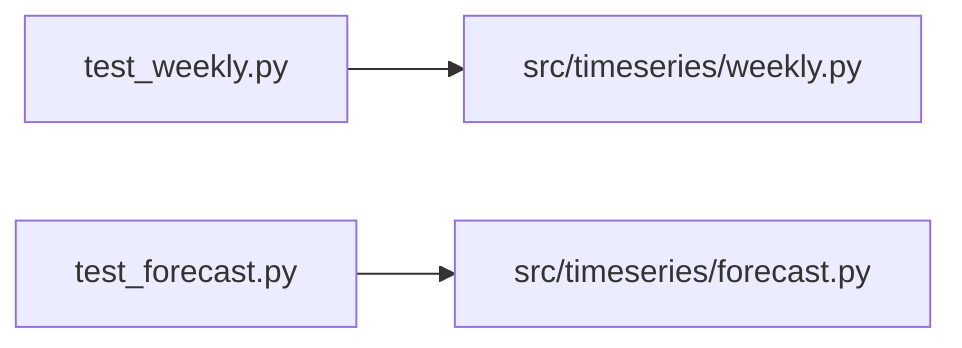

# tests/

ユニットテストと統合テスト。`src/` のモジュールに対応する形で構成されています。

## ディレクトリ構成

```
tests/
├── test_data/      # データ収集・前処理のテスト
├── test_nlp/       # NLP処理のテスト
├── test_timeseries/ # 週次時系列・予測のテスト
└── test_visualization/ # 可視化のテスト
```

---

## テストと対象モジュールの対応

テストは `src/` のモジュールと1対1ではなく、`steam_collector.py` にだけ2本のテストが当たっています。

**test_data/ — データ収集・前処理**


```mermaid
flowchart LR
    T1["test_steam_collector.py"] --> M1["src/data/steam_collector.py"]
    T2["test_filtering.py"] --> M1
    T3["test_preprocessing.py"] --> M2["src/data/preprocessing.py"]
```

`test_steam_collector.py` と `test_filtering.py` は実際にSteam APIへ通信します。実行には `.env` のAPIキー設定が必要です。

**test_nlp/ — NLP処理**


```mermaid
flowchart LR
    T4["test_sentiment.py"] --> M3["src/nlp/sentiment.py"]
    T5["test_evaluation.py"] --> M4["src/nlp/evaluation.py"]
    T6["test_topic.py"] --> M5["src/nlp/topic.py"]
    T7["test_topic_category.py"] --> M6["src/nlp/topic_category.py"]
    T8["test_topic_bundle.py"] --> M7["src/nlp/topic_bundle.py"]
    T9["test_topic_granularity.py"] --> M8["src/nlp/topic_granularity.py"]
    TA["test_topic_cooccurrence.py"] --> M9["src/nlp/topic_cooccurrence.py"]
```

**test_timeseries/ — 週次時系列**


```mermaid
flowchart LR
    TW["test_weekly.py"] --> W["src/timeseries/weekly.py"]
    TF["test_forecast.py"] --> F["src/timeseries/forecast.py"]
```

同じディレクトリの `test_game_selection.py` など3本は、収集スクリプトのテストです（下の表）。

### テストが無いモジュール

上の図の右側に出てこないファイルです。学習まわりの中核（モデル定義・学習ループ）が未カバーになっています。

| モジュール | 備考 |
|---|---|
| `src/nlp/model.py` | モデル定義・保存・読み込み。多くのスクリプトが依存している |
| `src/nlp/train.py` | 学習ループ・Early Stopping |
| `src/nlp/dataset.py` | Dataset / DataLoader 作成 |
| `src/data/dataset_split.py` | そもそもどのスクリプトからも呼ばれていない |
| `src/visualization/sentiment_plots.py` | 存在しないモジュールをimportしており、現状実行できない |

---

## 実行方法

```bash
make test           # 全テスト実行
make test-nlp       # NLPテストのみ
make test-topic     # トピック抽出テストのみ
```

---

## test_data/ — データ収集・前処理テスト

| ファイル | 対象モジュール | 説明 |
|---|---|---|
| `test_steam_collector.py` | `src/data/steam_collector.py` | Steam APIレビュー収集の動作確認 |
| `test_filtering.py` | `src/data/steam_collector.py` | langdetectフィルタリングの段階別検証（フィルタリング前後の比較） |
| `test_preprocessing.py` | `src/data/preprocessing.py` | テキスト前処理の動作確認 |
| `test_pool_tags.py` | `src/data/pool_tags.py` | 母集団キャッシュからのタグ読み出し・欠損の扱い |
| `test_collection_progress.py` | `src/data/collection_progress.py` | 進捗の保存と読み出し・統計を流しながら集計すること |
| `test_review_pagination.py` | `src/data/steam_collector.py` | ページングの停止条件・ページ単位の取得・cursorからの再開 |

> **注意**: `test_steam_collector.py` と `test_filtering.py` は実際にSteam APIを呼び出すため、実行には `.env` のAPIキー設定が必要です。

---

## test_nlp/ — NLPテスト

| ファイル | 対象モジュール | 説明 |
|---|---|---|
| `test_sentiment.py` | `src/nlp/sentiment.py` | 感情分析推論の動作確認 |
| `test_evaluation.py` | `src/nlp/evaluation.py` | 評価指標（Accuracy/F1等）の計算確認 |
| `test_topic.py` | `src/nlp/topic.py` | トピック抽出・英語フィルタリング・ゲーム名除去の動作確認 |
| `test_topic_category.py` | `src/nlp/topic_category.py` | トピックの仕分け（語彙の読み込み・分類・曖昧判定・①は証拠が要ること・`classify_with_evidence` が唯一の入口であること） |
| `test_element_vocabulary.py` | `scripts/nlp/update_element_vocabulary.py` | ①の語彙をタグから作ること・中身を表さないタグ・遊んだ結果の感想のタグを除くこと |
| `test_tag_semantics.py` | `src/nlp/tag_semantics.py` | タグとの意味の照合・判定ファイル（`configs/steam_tags.txt`）の読み込み・判定の無いタグや二重の判定があれば止まること |
| `test_topic_bundle.py` | `src/nlp/topic_bundle.py` | タグ語彙の生成・束ね先の決定・「その他」への集約 |
| `test_topic_granularity.py` | `src/nlp/topic_granularity.py` | マージ木の入れ子性・束のキーワード・束内のばらつき |
| `test_topic_cooccurrence.py` | `src/nlp/topic_cooccurrence.py` | 束ねたかの判定・束ねないとき公式の分類がそのまま単位に付くこと（束ねた単位・分類に無いトピックがあれば止まること）・リフトの計算・レシピの閾値・共起をゲーム数で数えること・ゲーム類似度 |
| `test_weekly.py` | `src/timeseries/weekly.py` | 週の切り方・シェアとポジ率の算出・パネルの密度と集中度（期間を省略すると止まること・期間の外を数えないこと）・共通の期間（収集ログの端の日を含む週は使わない／最も遅い oldest と最も早い newest で決まる／ログに無いゲームがあれば止まる）・土台の選び方（発売が期間開始の26週前ちょうどは含める・tier が違えば入らない・手で外せる・発売日が読めなければ止まる）・期間と土台をまとめて決める入口と画面の文・実データでの確認（`data/` がある環境だけ。無ければ飛ばす） |
| `test_forecast.py` | `src/timeseries/forecast.py` | 学習とテストの切り方（全単位で同じ週・欠測の除き方）・比べる相手2つ・MAE と比・勝ちの数え方（比が1未満だけ）・Prophet が年次季節性あり／なしで回ること・学習が時間切れのとき Newton 法で学び直すこと・発売を出来事として渡すこと（選び方・holidays の形・比べる相手が発売後の週を除くこと）・発売を段差の印としても渡すこと（印の付け方・比べる相手・発売の効き目の表・勝ちの基準）・設定を確かめ用の期間で選ぶこと（期間の切り方・選び方・Prophet への渡し方） |
| `test_timeseries_plots.py` | `src/visualization/timeseries_plots.py` | 図が書き出せること・充足度の配色が赤↔緑でないこと・予測の図が書き出せること・予測の4本が色と線種で見分けられること・発売の週の点線が範囲内のものだけ引かれること |
| `test_game_selection.py` | `scripts/collect/collect_timeseries_dataset.py` | 選定の3条件（ジャンル・土台の上限・タグ重なり）・既存を固定した追加・台帳の型往復 |
| `test_collection_coverage.py` | `scripts/collect/collect_timeseries_dataset.py` | 収集の網羅性判定（直近しか無いゲームと、直近しか取れなかったゲームの区別） |
| `test_row_trimming.py` | `scripts/collect/collect_timeseries_dataset.py` | 再収集・再開時のCSV切り詰め（重複を残さず、記録済みの行は消さないこと） |

---

## 関連

- [../src/README.md](../src/README.md) — テスト対象になっているモジュールの一覧と依存関係
- [../scripts/README.md](../scripts/README.md) — 実行スクリプトとデータの流れ
- [ドキュメントマップ](https://github.com/rindguitar/game-demand-forecast/wiki/Documentation-Map) — Wiki全体の繋がり
